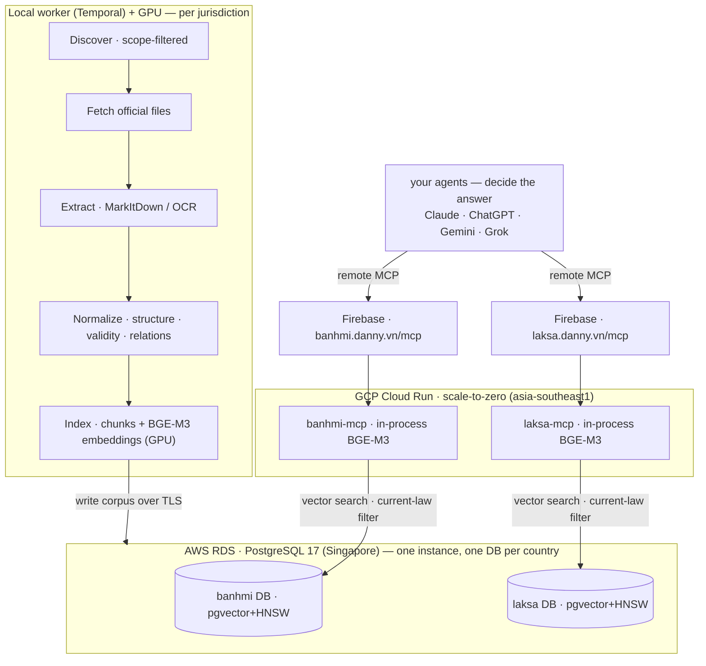

<div align="center">

# 🥖 banhmi · 🍜 laksa

**Evidence-only RAG corpus + MCP server for banking digital & technology regulation — one codebase, one corpus per country.**

[Vietnam → banhmi.danny.vn](https://banhmi.danny.vn) · [Malaysia → laksa.danny.vn](https://laksa.danny.vn) · [Docs](docs/README.md) · [Architecture](docs/ARCHITECTURE.md) · [Plan](PLAN.md)

[](LICENSE)
[](go.mod)
[](https://modelcontextprotocol.io)
[](https://banhmi.danny.vn)
[](https://laksa.danny.vn)

</div>

---

banhmi crawls **official government and regulator sources**, extracts and normalizes legal documents into
a trustworthy, citable RAG corpus, and serves it as **evidence over an MCP server** — exact citations,
validity, amendment/relation graph, provenance, and explicit coverage gaps. It is **multi-jurisdiction**:
one codebase, a **separate corpus / database / deployment per country** — **Vietnam** (`banhmi`,
Vietnamese) and **Malaysia** (`laksa`, English), each in its single binding legal language.

> **banhmi does not answer questions.** It serves data + evidence so **your own** agent/model
> (Claude, ChatGPT, Gemini, Grok, …) connects over MCP, retrieves exact citations, validity, relations,
> and gaps, and decides the answer itself. There is no built-in answer LLM — and weak data is never
> hidden behind confident prose. Repealed/superseded/not-yet-effective text is **badged**, never served
> as current law.

## Use it over MCP — live, free, no signup

Both jurisdictions are live as remote MCP (Streamable HTTP), public, HTTPS, no key:

| Jurisdiction | MCP endpoint | Ask in | Official sources |
|---|---|---|---|
| 🥖 **Vietnam** | `https://banhmi.danny.vn/mcp` | English or Vietnamese | VBPL · Công Báo · vanban.chinhphu · SBV |
| 🍜 **Malaysia** | `https://laksa.danny.vn/mcp` | English | AGC Laws of Malaysia · Bank Negara Malaysia · Securities Commission |

**Add it as a custom connector** (no server of your own needed — pick the endpoint above):

1. **Claude** (claude.ai — Pro, Max, Team or Enterprise) → **Settings → Connectors → Add custom connector** → name it (`banhmi` or `laksa`), paste the URL, leave authentication blank, **Add**. Then in any chat, open the connectors menu and toggle it on. *(Custom connectors require a paid Claude plan.)*
2. **ChatGPT** (Plus/Pro/Team/Edu) → turn on Developer mode → **Settings → Apps & Connectors → Add** → paste the URL → *No authentication*.
3. **Grok** → **Settings → Connectors → Add MCP server** → paste the URL.
4. **Gemini CLI** → add it under `mcpServers` in `~/.gemini/settings.json` (`httpUrl` = the endpoint).

The endpoints are public and unauthenticated — no account or API key is needed for banhmi/laksa themselves.

Then ask, e.g. *"What are the technology risk management requirements for banks?"* — you get ranked
provisions with their exact citation, validity badge, and a link back to the official source. **banhmi
serves the evidence; your model writes the answer.**

**The tools:** `search` · `document` · `corpus_status` · `quality_gaps` · `guide`.

## What it does

- **Scope-filtered daily discovery** of banking digital/technology regulation (IT & system safety,
  cybersecurity, data protection, cloud & outsourcing, e-transactions, digital channels, payments, e-KYC)
  — including cross-cutting laws that bind banks — with cross-source dedup.
- **Authoritative sources, verbatim** — reconciled and deduplicated into one document, never paraphrased;
  structure, relations, and validity taken from the richest source per jurisdiction.
- **High-fidelity extraction** — local MarkItDown for DOCX/HTML/born-digital PDF; EasyOCR (per-jurisdiction
  language) run as a batch for scanned or failed PDFs.
- **Evidence, not answers** — ranked hits with exact citations (VN **Điều/Khoản**, MY **Section/Subsection**),
  validity badges, confirmed relations, provenance, and explicit gaps.
- **Change tracking** — amendments, replacements/repeals, subsidiary legislation, and validity over time.
- **Query over MCP** — any user-owned agent connects; it retrieves the evidence and decides the answer.
- **Runs locally** via podman — no cloud account, no API keys for ingest, indexing, or serving.

## Official data sources

Public legal data, crawled politely (descriptive UA, fetch-concurrency caps, backoff). Sources are
pluggable — add your own under `pkg/ingest/`. See [`docs/design/SOURCES.md`](docs/design/SOURCES.md) and,
for Malaysia, [`docs/design/MALAYSIA.md`](docs/design/MALAYSIA.md).

**🥖 Vietnam (`banhmi`)**

| Source | Operator | Provides |
|---|---|---|
| **vbpl.vn** | National legal database — Bộ Tư pháp | Keyword-search discovery, DOCX/DOC/PDF/HTML, article structure, **relation graph**, **validity** |
| **congbao.chinhphu.vn** | Official Gazette — Văn phòng Chính phủ | New-document RSS signal + born-digital PDF/DOCX |
| **vanban.chinhphu.vn** | Government legal DB | Freshest central-law feed (before vbpl indexes it) |
| **sbv.hanoi.gov.vn** | State Bank of Vietnam portal | Supplementary SBV sweep, deduped by số ký hiệu |

**🍜 Malaysia (`laksa`)**

| Source | Operator | Provides |
|---|---|---|
| **lom.agc.gov.my** | Attorney General's Chambers — Laws of Malaysia | Federal **Acts** (born-digital PDF), validity dates, **P.U. subsidiary-legislation** relations |
| **bnm.gov.my** | Bank Negara Malaysia | **Policy documents & guidelines** (RMiT, cloud, e-KYC, payments, …) |
| **sc.com.my** | Securities Commission Malaysia | Capital-market technology guidelines |

## Architecture



A Medallion pipeline (**Bronze → Silver → Gold**) with a durable `ingest` ledger between stages:

- **Discover → Fetch (Bronze):** crawl scope-filtered official sources; download raw files.
- **Extract → Normalize (Silver):** convert to Markdown via **MarkItDown** (scanned/failed PDFs via
  **EasyOCR**, batched); parse the provision tree, validity, and relations.
- **Index (Gold):** chunk by article + **BGE-M3** embeddings into pgvector. Retrieval is **vector-only**
  with a current-law pre-filter; BM25/`pg_search` is eval-only, never production.
- **Worker — local** (GPU) writes the corpus over TLS to **AWS RDS** (Singapore, PG17, pgvector+HNSW).
- **Serve — GCP Cloud Run** (`asia-southeast1`): one scale-to-zero Go MCP service **per jurisdiction**
  that embeds queries **in-process** (BGE-M3, no sidecar); the public domain is served by **Firebase
  Hosting** in front of Cloud Run. Same image, selected by `BANHMI_JURISDICTION` + `BANHMI_DATABASE_NAME`.

See [`docs/ARCHITECTURE.md`](docs/ARCHITECTURE.md) for the full design.

## Status

**MVP1 — both jurisdictions live.** Deployed and serving evidence; validation and hardening ongoing.

- **🥖 banhmi (Vietnam):** live at `https://banhmi.danny.vn/mcp` — hundreds of official documents across
  four sources (vbpl · congbao · vanban · SBV).
- **🍜 laksa (Malaysia):** live at `https://laksa.danny.vn/mcp` — Acts, policy documents & guidelines
  across three sources (AGC LOM · BNM · SC), with derived validity and subsidiary-legislation relations.
- Shared core, customized per country behind interfaces (sources, structure parser, citation model,
  scope vocabulary, MCP brief/language) — see [`docs/design/MALAYSIA.md`](docs/design/MALAYSIA.md).

See [`PLAN.md`](PLAN.md) for the roadmap and current phase.

## Self-host

Everything runs in podman — full guide in [`docs/DEVELOPMENT.md`](docs/DEVELOPMENT.md).

```bash
cp config/config.example.yaml config/config.yaml
export BANHMI_DATABASE_PASSWORD=banhmi
make dev-up        # Postgres+pgvector, Redis, Temporal
make migrate       # apply schema
go run ./cmd/seed  # load config vocabularies
```

Then build the corpus and serve MCP (see [`docs/DEVELOPMENT.md`](docs/DEVELOPMENT.md)). A fresh clone
reaches *"ingesting, indexing, and serving evidence over MCP"* with **no API keys** — born-digital
extraction and the required self-hosted BGE-M3 embedder run locally. Validate locally first, then deploy
(generic 3-part deploy in [`docs/DEPLOYMENT.md`](docs/DEPLOYMENT.md)).

## Documentation

- [Architecture](docs/ARCHITECTURE.md) — design, data model, folder layout, interfaces
- [Local development](docs/DEVELOPMENT.md) — dev stack, migrations, build/run/test
- [Deployment](docs/DEPLOYMENT.md) — generic 3-part deploy (worker · database · MCP)
- [Plan](PLAN.md) — roadmap, phases, open decisions
- [Sources](docs/design/SOURCES.md) · [Pipeline](docs/design/PIPELINE.md) · [Schema](docs/design/SCHEMA.md) · [Extraction](docs/design/EXTRACTION.md) · [RAG](docs/design/RAG.md)
- [Malaysia](docs/design/MALAYSIA.md) — the `laksa` jurisdiction: sources, parser, deploy
- [Documentation index](docs/README.md)

## License

[Apache 2.0](LICENSE).
