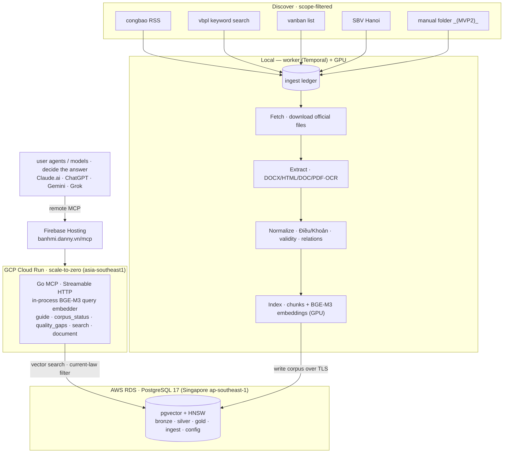

# 🥖 Bánh mì

[](LICENSE)
[](go.mod)
[](https://modelcontextprotocol.io)
[](https://banhmi.danny.vn)

Regulatory intelligence for Vietnamese banking — focused on digital and technology regulation:
IT, mobile banking, cybersecurity, data, electronic transactions, cloud, outsourcing, digital
channels, and technology operations.

banhmi collects regulatory updates daily from official Vietnamese government and regulator websites,
parses legal documents and PDFs, and indexes them into a trustworthy, citable RAG corpus. The platform
runs on your own infrastructure with podman; it serves the corpus as evidence over an **MCP server**,
and you bring your own model or agent — banhmi does not answer questions itself.

`Apache 2.0` · `Go 1.26` · `PostgreSQL + pgvector` · `Temporal` · `podman`

## Use it over MCP

banhmi is **live** at **`https://banhmi.danny.vn/mcp`** — remote MCP (Streamable HTTP), public, no key, no
setup. Add it to any MCP-capable agent and ask in **English or Vietnamese**:

1. **Add the connector** → `https://banhmi.danny.vn/mcp` (Claude, ChatGPT, Gemini, Grok, or any MCP client).
2. **Ask**, e.g. _"What are Vietnam's IT system safety requirements for banks?"_
3. **Get evidence** — exact `Điều/Khoản` citations, số ký hiệu, validity status, and a link back to the
   official source (VBPL / Công Báo / SBV). banhmi serves the evidence; **your** model writes the answer.

Tools: `search` · `document` · `corpus_status` · `quality_gaps` · `guide`. Prefer to self-host? See the
[Quickstart](#quickstart) below.

## Official data sources

banhmi crawls these official Vietnamese government sources (public legal data). The first release
focuses on **State Bank of Vietnam** (Ngân hàng Nhà nước Việt Nam) documents and technology-related
regulation.

| Source                           | Operator                                                 | What it provides                                                                                                                                           |
| -------------------------------- | -------------------------------------------------------- | ---------------------------------------------------------------------------------------------------------------------------------------------------------- |
| **https://congbao.chinhphu.vn/** | Công báo — Văn phòng Chính phủ (Official Gazette)        | New-document **RSS signal** + authoritative, born-digital **PDF/DOCX** via the CDN                                                                          |
| **https://vbpl.vn/**             | Cơ sở dữ liệu quốc gia về văn bản pháp luật — Bộ Tư pháp | **Keyword search API** (the discovery engine), authoritative **DOCX/DOC/PDF/HTML**, article structure, **relation graph**, and **validity status**             |
| **https://vanban.chinhphu.vn/**  | Hệ thống văn bản — Văn phòng Chính phủ (Government legal DB) | The freshest central-law feed (HTML list + born-digital files via the CDN) — carries new central laws **before vbpl indexes them**; deduped against vbpl/congbao by số ký hiệu |
| **https://sbv.hanoi.gov.vn/**    | Ngân hàng Nhà nước (SBV portal)                          | Supplementary SBV-portal sweep (HTML listing), deduplicated against vbpl/congbao by số ký hiệu                                                              |
| **https://phapluat.gov.vn/**     | Cổng Pháp luật Quốc gia — Bộ Tư pháp                     | National law portal: full text (HTML) and document relations — _MVP2_                                                                                      |
| **manual folder** (offline, _MVP2_) | the operator                                          | Drop manually-downloaded PDF/DOCX/DOC into a watched folder, ingested through the same pipeline — _planned, MVP2_                                              |

Discovery is **scope-filtered** to banking digital/technology regulation — including cross-cutting laws
that bind banks but are not issued by the State Bank (e.g. _Luật An ninh mạng_, _Luật Bảo vệ dữ liệu cá
nhân_). See [`docs/design/SOURCES.md`](docs/design/SOURCES.md).

Sources are pluggable — add your own under `pkg/ingest/`. See
[`docs/design/SOURCES.md`](docs/design/SOURCES.md) for how each source is crawled, and
[crawler etiquette](docs/ARCHITECTURE.md#crawler-etiquette-and-compliance) for the compliance posture
(this is public government legal data; banhmi uses Temporal activity caps for fetch concurrency, and
operators decide what is appropriate for their jurisdiction).

## What it does

- Daily, **scope-filtered** incremental discovery (banking digital/tech regulation, incl. cross-cutting
  laws that bind banks) with cross-source dedup. _(A **manual folder** import for self-downloaded
  documents is planned — MVP2.)_
- congbao, vbpl, vanban, and SBV Hanoi as authoritative government sources — reconciled and deduplicated into
  one document, with structure, relations, and validity from vbpl.
- High-fidelity extraction: MarkItDown for DOCX/HTML/born-digital PDF; EasyOCR (`vi`), run as a batch,
  for scanned or failed PDF text.
- **Evidence, not answers**: ranked hits with exact **Điều/Khoản** citations, validity badges,
  confirmed amendment relations, provenance, and explicit coverage gaps — never repealed text as current.
- Change tracking: amendments, replacements, and validity status across documents.
- Query over an **MCP server** — connect any user-owned agent (Claude.ai, ChatGPT, Gemini, Grok), which
  retrieves the evidence and decides the answer itself.
- Runs fully locally via podman with no cloud account and no API keys for ingest, indexing, and serving.

## Architecture



A Medallion pipeline (above), **Bronze → Silver → Gold**, with a durable `ingest` ledger as the queue
between stages:

- **Discover → Fetch (Bronze):** crawl scope-filtered official sources — **congbao**, **vbpl**, **vanban**,
  **SBV Hanoi** — and download raw files as fetched. *(`manual folder` ingestion is a future path — MVP2.)*
- **Extract → Normalize (Silver):** convert to Markdown via local **MarkItDown** (legacy DOC → LibreOffice
  PDF → MarkItDown); scanned/failed PDFs via **EasyOCR (`vi`)**, batched. Parse the **Điều/Khoản** tree,
  validity, and relations.
- **Index (Gold):** chunk by Điều + **BGE-M3** embeddings into pgvector. Retrieval is **vector-only**
  (current-law filter); BM25/`pg_search` is eval-only, never production.
- **Worker — local:** runs on the local GPU; writes the corpus over TLS to **AWS RDS PostgreSQL**
  (Singapore `ap-southeast-1`, Postgres 17, pgvector + HNSW).
- **Serve — GCP Cloud Run** (`asia-southeast1`): one **scale-to-zero** Go MCP service that embeds queries
  **in-process** (BGE-M3) — no sidecar; the public domain `https://banhmi.danny.vn/mcp` is served by
  **Firebase Hosting** in front of Cloud Run. Hosted agents connect over remote MCP (Streamable HTTP).
- **Gemma 4 OCR enhancement:** deferred to **MVP2** — not in the current pipeline.

See [`docs/ARCHITECTURE.md`](docs/ARCHITECTURE.md) for the full design.

## Status

**MVP1 — live.** Deployed and serving evidence; validation and hardening ongoing.

- **Live:** corpus on **AWS RDS PostgreSQL** (`ap-southeast-1`) + MCP on **GCP Cloud Run**
  (`asia-southeast1`) behind **Firebase Hosting** at `https://banhmi.danny.vn/mcp`.
- **Built:** scope-filtered discovery, fetch/download, MarkItDown extraction, EasyOCR fallback, the
  DB-seeded config layer, and the MCP evidence server — across **four official sources** (vbpl, vanban,
  congbao, SBV Hanoi).
- **Now:** validating extraction / validity / relations on real SBV documents.
- **MVP2:** Gemma 4 OCR enhancement.

See [`PLAN.md`](PLAN.md) for the roadmap and current phase.

## Quickstart

Everything runs in podman — full guide in [`docs/DEVELOPMENT.md`](docs/DEVELOPMENT.md).

```bash
cp config/config.example.yaml config/config.yaml
export BANHMI_DATABASE_PASSWORD=banhmi
make dev-up        # Postgres+pgvector+pg_search, Redis, Temporal
make migrate       # apply schema
go run ./cmd/seed  # load config vocabularies
```

Then build the corpus and serve MCP (see [`docs/DEVELOPMENT.md`](docs/DEVELOPMENT.md)). A fresh clone
reaches **"ingesting, indexing, and serving evidence over MCP"** with **no API keys** — born-digital
extraction and the **required** self-hosted BGE-M3 embedder run locally. Validate locally first, then deploy.

## Documentation

- [Architecture](docs/ARCHITECTURE.md) — design, data model, folder layout, interfaces
- [Local development](docs/DEVELOPMENT.md) — dev stack, migrations, build/run/test, everyday commands
- [Deployment](docs/DEPLOYMENT.md) — generic 3-part deploy (worker · database · MCP), bring your own stack
- [Plan](PLAN.md) — roadmap, phases, open decisions
- [Sources](docs/design/SOURCES.md) — scope, discovery, and per-source crawl details
- [Pipeline](docs/design/PIPELINE.md) — data flows + the Temporal stage workflows
- [Schema](docs/design/SCHEMA.md) — data model + DB-seeded config
- [Extraction](docs/design/EXTRACTION.md) — DOCX/DOC/HTML/PDF extraction + OCR gate
- [RAG](docs/design/RAG.md) — chunking, retrieval, evidence, gaps, eval
- [Documentation index](docs/README.md)

## License

[Apache 2.0](LICENSE).
