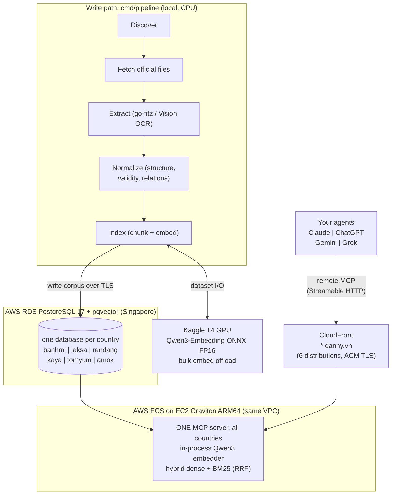

<div align="center">

# banhmi

**Evidence-only RAG corpus + MCP server for Southeast-Asian banking & financial regulation and cross-cutting technology law — one codebase, one corpus per country.**

[Docs](docs/README.md) · [Architecture](docs/ARCHITECTURE.md) · [Plan](PLAN.md)

[](LICENSE)
[](go.mod)
[](https://modelcontextprotocol.io)

</div>

---

banhmi crawls official government sources, extracts legal documents into a citable RAG corpus, and
serves **evidence over MCP** — exact citations, validity, amendment relations, provenance, and coverage
gaps. It does not answer questions: your agent/model connects, retrieves evidence, and decides the answer.

## Use it over MCP

Remote MCP (Streamable HTTP), public, HTTPS, no signup or API key:

| Jurisdiction | Endpoint | Ask in | Official sources |
|---|---|---|---|
| Vietnam | `https://banhmi.danny.vn/mcp` | Vietnamese | VBPL · Cong Bao · vanban.chinhphu · SBV |
| Malaysia | `https://laksa.danny.vn/mcp` | English | AGC Laws of Malaysia · Bank Negara Malaysia · Securities Commission |
| Indonesia | `https://rendang.danny.vn/mcp` | Indonesian | BPK JDIH · Bank Indonesia · OJK |
| Singapore | `https://kaya.danny.vn/mcp` | English | SSO · MAS · PDPC · CSA |
| Thailand | `https://tomyum.danny.vn/mcp` | Thai | OCS · BOT · SEC · ETDA |
| Cambodia | `https://amok.danny.vn/mcp` | English | NBC · ODC · CDC |

**Add as a custom connector** (pick an endpoint above):

1. **Claude** (Pro/Max/Team/Enterprise) → Settings → Connectors → Add custom connector → paste URL, no auth.
2. **ChatGPT** (Plus/Pro/Team/Edu) → Developer mode → Settings → Apps & Connectors → Add → paste URL, no auth.
3. **Grok** → Settings → Connectors → Add MCP server → paste URL.
4. **Gemini CLI** → add under `mcpServers` in `~/.gemini/settings.json` (`httpUrl` = endpoint).

Ask e.g. *"What are the technology risk management requirements for banks?"* — you get ranked
provisions with citation, validity badge, and official source link.

**Tools:** `search` · `document` · `corpus_status` · `quality_gaps` · `guide`.

## What it does

- **Scope-filtered discovery** of banking & financial regulation and cross-cutting technology law
  (cybersecurity, data protection, AI, cloud, e-transactions, payments, digital banking).
- **Verbatim authoritative text** — extracted from official government sources, never paraphrased.
- **High-fidelity extraction** — go-fitz (MuPDF) for DOCX/HTML/born-digital PDF; Google Vision OCR
  (batched, cached) for scanned PDFs.
- **Evidence, not answers** — exact native citations (VN Dieu/Khoan, MY Section/Subsection, ID
  Pasal/ayat), validity badges, confirmed relations, provenance, and gaps.
- **Change tracking** — amendments, repeals, subsidiary legislation, validity over time.

Sources are pluggable — see [`docs/design/SOURCES.md`](docs/design/SOURCES.md) and
[`docs/design/jurisdictions/`](docs/design/jurisdictions/README.md).

## Architecture


```mermaid
flowchart TB
  subgraph LOCAL["Write path: cmd/pipeline (local, CPU)"]
    DISC["Discover"] --> FETCH["Fetch official files"]
    FETCH --> EXT["Extract (go-fitz / Vision OCR)"]
    EXT --> NORM["Normalize (structure,<br/>validity, relations)"]
    NORM --> IDX["Index (chunk + embed)"]
  end

  KAGGLE["Kaggle T4 GPU<br/>Qwen3-Embedding ONNX FP16<br/>bulk embed offload"]
  IDX <-->|"dataset I/O"| KAGGLE

  subgraph RDS["AWS RDS PostgreSQL 17 + pgvector (Singapore)"]
    DB[("one database per country<br/>banhmi | laksa | rendang<br/>kaya | tomyum | amok")]
  end

  IDX -->|"write corpus over TLS"| DB

  subgraph ECS["AWS ECS on EC2 Graviton ARM64 (same VPC)"]
    MCP["ONE MCP server, all countries<br/>in-process Qwen3 embedder<br/>hybrid dense + BM25 (RRF)"]
  end

  DB --> MCP
  CF["CloudFront<br/>*.danny.vn<br/>(6 distributions, ACM TLS)"] --> MCP
  USERS["Your agents<br/>Claude | ChatGPT<br/>Gemini | Grok"] -->|"remote MCP<br/>(Streamable HTTP)"| CF
```

**Medallion pipeline** (Bronze → Silver → Gold):

1. **Discover → Fetch (Bronze)** — scope-filtered crawl; download raw files.
2. **Extract → Normalize (Silver)** — go-fitz/MuPDF (scanned PDFs via Vision OCR, batched and cached);
   parse provision tree, validity, relations.
3. **Index (Gold)** — chunk by article + Qwen3-Embedding (ONNX FP16, 1024 dims) into pgvector.
   Hybrid retrieval: dense vectors + BM25 sparse vectors (`sparsevec`), RRF-fused with a query router,
   current-law pre-filter.
4. **Serve** — CloudFront → one ECS EC2 Graviton process (in-process Qwen3 ONNX query embedder),
   same VPC as RDS. Each domain's `GET /` serves a guide page; `/mcp` serves agents.

See [`docs/ARCHITECTURE.md`](docs/ARCHITECTURE.md).

## Status

**Retrieval quality** — golden-set eval per jurisdiction (hybrid retrieval, top-8, measured
2026-07-19 on the deployed corpora; harness in [`docs/design/RAG.md`](docs/design/RAG.md#eval)):

| Jurisdiction | Chunks | Golden cases | Recall@8 | MRR@8 | Current-law precision | Abstention |
|---|---:|---:|---:|---:|---:|---:|
| 🥖 Vietnam | 52,546 | 80 | **92.7%** | 69.7% | 100% | 100% |
| 🍜 Malaysia | 11,286 | 72 | **94.3%** | 79.6% | 100% | 100% |
| 🍛 Indonesia | 160,142 | 110 | **79.8%** | 62.4% | 100% | 100% |
| 🍞 Singapore | 27,951 | 76 | **93.5%** | 79.9% | 100% | 97.9% |
| 🍲 Thailand | 29,736 | 58 | **89.5%** | 72.0% | 100% | 96.6% |
| 🐟 Cambodia | 2,609 | 42 | **93.1%** | 74.4% | 100% | 100% |

Recall@8 = expected citations found in the top-8 evidence; current-law precision = returned
primary hits that are in-force law; abstention = out-of-scope questions correctly refused.

See [`PLAN.md`](PLAN.md) for the roadmap.

## Self-host

Everything runs in podman — full guide in [`docs/DEVELOPMENT.md`](docs/DEVELOPMENT.md).

```bash
cp config/config.example.yaml config/config.yaml
export BANHMI_DATABASE_PASSWORD=banhmi
make dev-up        # Postgres+pgvector
make migrate       # apply schema
go run ./cmd/seed  # load config vocabularies
```

Build the corpus and serve MCP per [`docs/DEVELOPMENT.md`](docs/DEVELOPMENT.md). A fresh clone reaches
ingesting + serving with **no API keys**. Deploy via [`docs/DEPLOYMENT.md`](docs/DEPLOYMENT.md).

## Documentation

- [Architecture](docs/ARCHITECTURE.md) — design, data model, folder layout, interfaces
- [Local development](docs/DEVELOPMENT.md) — dev stack, migrations, build/run/test
- [Deployment](docs/DEPLOYMENT.md) — generic 3-part deploy (worker, database, MCP)
- [Publishing](docs/PUBLISHING.md) — listing the MCP servers in agent directories
- [Plan](PLAN.md) — roadmap, phases, open decisions
- [Sources](docs/design/SOURCES.md) · [Pipeline](docs/design/PIPELINE.md) · [Schema](docs/design/SCHEMA.md) · [Extraction](docs/design/EXTRACTION.md) · [RAG](docs/design/RAG.md) · [Workflow Eval](docs/design/WORKFLOW-EVAL.md)
- [Jurisdictions](docs/design/jurisdictions/README.md) — country registry ·
  [playbook](docs/design/jurisdictions/PLAYBOOK.md) · [Malaysia](docs/design/jurisdictions/MALAYSIA.md) ·
  [Indonesia](docs/design/jurisdictions/INDONESIA.md) / [Thailand](docs/design/jurisdictions/THAILAND.md) / [Singapore](docs/design/jurisdictions/SINGAPORE.md)
- [Documentation index](docs/README.md)

## License

[Apache 2.0](LICENSE).
