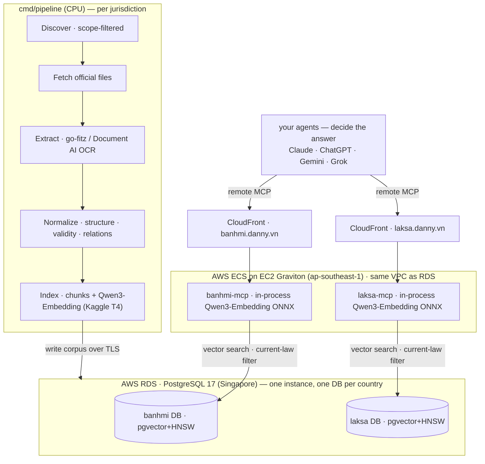

<div align="center">

# 🥖 banhmi · 🍜 laksa

**Evidence-only RAG corpus + MCP server for banking & financial regulation and cross-cutting technology law — one codebase, one corpus per country.**

[Vietnam → banhmi.danny.vn](https://banhmi.danny.vn) · [Malaysia → laksa.danny.vn](https://laksa.danny.vn) · [Docs](docs/README.md) · [Architecture](docs/ARCHITECTURE.md) · [Plan](PLAN.md)

[](LICENSE)
[](go.mod)
[](https://modelcontextprotocol.io)
[](https://banhmi.danny.vn)
[](https://laksa.danny.vn)

</div>

---

banhmi crawls **official government sources**, extracts legal documents into a citable RAG corpus, and
serves **evidence over MCP** — exact citations, validity, amendment relations, provenance, and coverage
gaps. Multi-jurisdiction: **Vietnam** (`banhmi`) and **Malaysia** (`laksa`) are live; **Indonesia**
(`rendang`) is dormant (code kept, deployment decommissioned); **Thailand** and **Singapore** are planned.

> **banhmi does not answer questions.** Your agent/model connects over MCP, retrieves citations and
> validity, and decides the answer. No built-in LLM — repealed/superseded text is badged, never served
> as current.

## Use it over MCP — live, free, no signup

Remote MCP (Streamable HTTP), public, HTTPS, no key:

| Jurisdiction | MCP endpoint | Ask in | Official sources |
|---|---|---|---|
| 🥖 **Vietnam** | `https://banhmi.danny.vn/mcp` | English or Vietnamese | VBPL · Công Báo · vanban.chinhphu · SBV |
| 🍜 **Malaysia** | `https://laksa.danny.vn/mcp` | English | AGC Laws of Malaysia · Bank Negara Malaysia · Securities Commission |

**Add as a custom connector** (pick an endpoint above):

1. **Claude** (Pro/Max/Team/Enterprise) → Settings → Connectors → Add custom connector → paste URL, no auth.
2. **ChatGPT** (Plus/Pro/Team/Edu) → Developer mode → Settings → Apps & Connectors → Add → paste URL, no auth.
3. **Grok** → Settings → Connectors → Add MCP server → paste URL.
4. **Gemini CLI** → add under `mcpServers` in `~/.gemini/settings.json` (`httpUrl` = endpoint).

No account or API key needed. Ask e.g. *"What are the technology risk management requirements for
banks?"* — you get ranked provisions with citation, validity badge, and official source link.

**Tools:** `search` · `document` · `corpus_status` · `quality_gaps` · `guide`.

## What it does

- **Scope-filtered discovery** of banking & financial regulation and cross-cutting technology law
  (e.g. cybersecurity, data protection, AI, cloud, e-transactions, payments, digital banking).
- **Verbatim authoritative sources** — reconciled into one document per act, never paraphrased.
- **High-fidelity extraction** — go-fitz (MuPDF) for DOCX/HTML/born-digital PDF; Document AI or EasyOCR
  (batched) for scanned PDFs.
- **Evidence, not answers** — exact citations (VN Điều/Khoản, MY Section/Subsection), validity badges,
  confirmed relations, provenance, and gaps.
- **Change tracking** — amendments, repeals, subsidiary legislation, validity over time.
- **MCP query surface** — any agent connects, retrieves evidence, decides the answer.

## Official data sources

Public legal data, crawled politely. Sources are pluggable — add your own under `pkg/ingest/`.
See [`docs/design/SOURCES.md`](docs/design/SOURCES.md) and
[`docs/design/jurisdictions/`](docs/design/jurisdictions/README.md).

**🥖 Vietnam (`banhmi`)**

| Source | Operator | Provides |
|---|---|---|
| **vbpl.vn** | National legal database — Bộ Tư pháp | Discovery, DOCX/DOC/PDF/HTML, article structure, **relation graph**, **validity** |
| **congbao.chinhphu.vn** | Official Gazette — Văn phòng Chính phủ | New-document RSS + born-digital PDF/DOCX |
| **vanban.chinhphu.vn** | Government legal DB | Freshest central-law feed |
| **sbv.hanoi.gov.vn** | State Bank of Vietnam portal | Supplementary SBV sweep (merged by số ký hiệu) |

**🍜 Malaysia (`laksa`)**

| Source | Operator | Provides |
|---|---|---|
| **lom.agc.gov.my** | Attorney General's Chambers — Laws of Malaysia | Federal **Acts** (born-digital PDF), validity, **P.U.** relations |
| **bnm.gov.my** | Bank Negara Malaysia | **Policy documents & guidelines** (RMiT, cloud, e-KYC, payments, …) |
| **sc.com.my** | Securities Commission Malaysia | Capital-market technology guidelines |

**🍛 Indonesia (`rendang`)** — dormant (sources `bpk`/`bi` kept in the codebase; deployment
decommissioned 2026-07-11).

## Architecture


```mermaid
flowchart TB
  subgraph LOCAL["cmd/pipeline (CPU) — per jurisdiction"]
    DISC["Discover · scope-filtered"] --> DL["Fetch official files"]
    DL --> EXT["Extract · go-fitz / Document AI OCR"]
    EXT --> NORM["Normalize · structure · validity · relations"]
    NORM --> IDX["Index · chunks + Qwen3-Embedding (Kaggle T4)"]
  end

  subgraph RDS["AWS RDS · PostgreSQL 17 (Singapore) — one instance, one DB per country"]
    PGVN[("banhmi DB · pgvector+HNSW")]
    PGMY[("laksa DB · pgvector+HNSW")]
  end

  subgraph ECS["AWS ECS on EC2 Graviton (ap-southeast-1) · same VPC as RDS"]
    MCPVN["banhmi-mcp · in-process Qwen3-Embedding ONNX"]
    MCPMY["laksa-mcp · in-process Qwen3-Embedding ONNX"]
  end

  IDX -->|write corpus over TLS| RDS
  MCPVN -->|vector search · current-law filter| PGVN
  MCPMY -->|vector search · current-law filter| PGMY
  CFVN["CloudFront · banhmi.danny.vn"] --> MCPVN
  CFMY["CloudFront · laksa.danny.vn"] --> MCPMY
  USERS["your agents — decide the answer<br/>Claude · ChatGPT · Gemini · Grok"] -->|remote MCP| CFVN & CFMY
```

Medallion pipeline (**Bronze → Silver → Gold**):

1. **Discover → Fetch (Bronze):** scope-filtered crawl; download raw files.
2. **Extract → Normalize (Silver):** go-fitz / MuPDF (scanned PDFs via Document AI / EasyOCR, batched);
   parse provision tree, validity, relations.
3. **Index (Gold):** chunk by article + Qwen3-Embedding (ONNX FP16, 1024 dims) into pgvector.
   **Hybrid retrieval** — dense vectors + BM25 sparse vectors (`sparsevec`), RRF-fused with a query
   router, current-law pre-filter.
4. **Serve:** AWS CloudFront → ECS on EC2 Graviton (in-process Qwen3-Embedding ONNX), same VPC as
   RDS (Singapore, PG17). Each domain's `GET /` serves a guide page; `/mcp` serves agents.

See [`docs/ARCHITECTURE.md`](docs/ARCHITECTURE.md).

## Status

**MVP1 — VN and MY live.** Validation and hardening ongoing.

| Jurisdiction | Endpoint | Sources | Status |
|---|---|---|---|
| 🥖 Vietnam | `banhmi.danny.vn/mcp` | vbpl · congbao · vanban · SBV | **Live** |
| 🍜 Malaysia | `laksa.danny.vn/mcp` | AGC LOM · BNM · SC | **Live** |
| 🇮🇩 Indonesia | — | BPK · BI (code dormant) | Dormant (decommissioned 2026-07-11) |
| 🇸🇬 Singapore | — | — | Proposed |
| 🇹🇭 Thailand | — | — | Proposed |

See [`PLAN.md`](PLAN.md) for the roadmap.

## Self-host

Everything runs in podman — full guide in [`docs/DEVELOPMENT.md`](docs/DEVELOPMENT.md).

```bash
cp config/config.example.yaml config/config.yaml
export BANHMI_DATABASE_PASSWORD=banhmi
make dev-up        # Postgres+pgvector
make migrate       # apply schema
go run ./cmd/seed  # load config vocabularies
```

Build the corpus and serve MCP per [`docs/DEVELOPMENT.md`](docs/DEVELOPMENT.md). A fresh clone reaches
ingesting + serving with **no API keys**. Deploy via [`docs/DEPLOYMENT.md`](docs/DEPLOYMENT.md).

## Documentation

- [Architecture](docs/ARCHITECTURE.md) — design, data model, folder layout, interfaces
- [Local development](docs/DEVELOPMENT.md) — dev stack, migrations, build/run/test
- [Deployment](docs/DEPLOYMENT.md) — generic 3-part deploy (worker · database · MCP)
- [Plan](PLAN.md) — roadmap, phases, open decisions
- [Sources](docs/design/SOURCES.md) · [Pipeline](docs/design/PIPELINE.md) · [Schema](docs/design/SCHEMA.md) · [Extraction](docs/design/EXTRACTION.md) · [RAG](docs/design/RAG.md)
- [Jurisdictions](docs/design/jurisdictions/README.md) — country registry ·
  [playbook](docs/design/jurisdictions/PLAYBOOK.md) · [Malaysia](docs/design/jurisdictions/MALAYSIA.md) ·
  [Indonesia](docs/design/jurisdictions/INDONESIA.md) / [Thailand](docs/design/jurisdictions/THAILAND.md) / [Singapore](docs/design/jurisdictions/SINGAPORE.md)
- [Documentation index](docs/README.md)

## License

[Apache 2.0](LICENSE).
