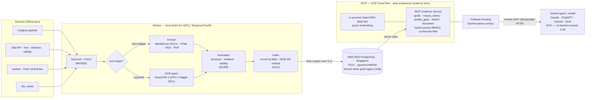

# banhmi architecture

banhmi is an **evidence-only RAG corpus + MCP server** for Vietnamese banking **digital/technology**
regulation (IT, cybersecurity, data, cloud, e-transactions, outsourcing, digital channels, technology
operations). It crawls official government/regulator sources, extracts and normalizes documents into a
trustworthy, citable knowledge base — exact **Điều/Khoản**, validity, amendment relations, provenance,
and coverage gaps — and serves that evidence over **MCP**.

**banhmi does not answer questions.** A **user-owned agent/model** (Claude.ai, ChatGPT, Gemini, Grok)
connects over MCP, retrieves exact citations/validity/relations/gaps, and decides the answer itself.
There is **no built-in answer LLM** — answering, if ever wanted, is a **separate microservice**.

**Deploy shape (MVP1, split-cloud, scale-to-zero)** — see [Deployment](#deployment-mvp1):

1. **Worker — local:** the local Intel Arc GPU runs extract/embed/index and writes the corpus to **AWS RDS PostgreSQL** (Singapore `ap-southeast-1`).
2. **MCP — GCP Cloud Run:** Go MCP + **in-process OpenVINO BGE-M3** embedder (index model, single binary, no sidecar); scales to zero.
3. **Public endpoint:** **https://banhmi.danny.vn/mcp** via **Firebase Hosting** in front of Cloud Run; hosted agents connect over remote MCP (Streamable HTTP).

Conventions and the canonical agent guide live in [`CLAUDE.md`](../CLAUDE.md); the roadmap and current
phase in [`PLAN.md`](../PLAN.md). This doc is the **system-design overview**; deep dives live in
[`docs/design/`](design/).

## Design principles

| Principle | What it means |
|-----------|---------------|
| **Evidence-only, MCP-first** | banhmi exposes citations, validity, relations, provenance, and gaps over MCP. The user's model answers; banhmi never synthesizes an answer or calls an answer LLM. |
| **Data accuracy is the product** | Good data + any decent model = good answers; bad data = confidently wrong legal answers. INPUT (the corpus) is the hard, valuable part; OUTPUT is retrieval + the MCP tools. |
| **Hybrid retrieval (embedder required)** | Retrieval is dense BGE-M3 vectors + BM25 sparse vectors (pgvector `sparsevec`) over pgvector, RRF-fused with a deterministic query router, under a current-law filter. The embedder is **mandatory**, not optional; `pg_search`/ParadeDB BM25 is not used (unavailable on managed RDS). |
| **Worker local → DB on RDS, MCP on Cloud Run** | The worker (GPU extraction/indexing) stays local and writes the corpus to AWS RDS PostgreSQL (Singapore); the MCP server + in-process embedder run on GCP Cloud Run (scale-to-zero), public at banhmi.danny.vn/mcp via Firebase Hosting. Only the DB and MCP endpoint are reachable; the DB port is open to `0.0.0.0/0` but TLS-required + password-gated (no Cloud Run NAT, removed 2026-06-13). Validate dev locally first, then deploy. |
| **Legal accuracy and provenance** | Prefer deterministic, extractive text — **no AI as the canonical parser**. Every chunk cites its exact Điều/Khoản; OCR is gated/flagged and never the sole source of binding text. Never present repealed/superseded/not-yet-effective text as current. |
| **Medallion + ingest, don't infer** | Bronze (raw) → Silver (normalized) → Gold (RAG); layers communicate through the database, not Go imports. When a source already exposes legal structure or amendment relations, ingest them directly. |
| **Pluggable, podman-first** | Sources, extractors, embedders, and retrievers are config-selected interfaces (no hardcoded vendor); all infrastructure and extraction engines run as OCI containers, no host installs. |

## Data sources

SBV digital/tech regulation from four official government sources (per-source crawl/filter/download in
[`docs/design/SOURCES.md`](design/SOURCES.md)):

| Source | Operator | Access | Primary text (RAG quality) | Relations / validity |
|--------|----------|--------|----------------------------|----------------------|
| congbao.chinhphu.vn | Văn phòng Chính phủ (Official Gazette) | Server-rendered HTML + CDN file download | Born-digital **PDF + DOCX** (9/10) | Partial ("sơ đồ") |
| vbpl.vn | Bộ Tư pháp (national VBQPPL DB) | **JSON API** (moj gateway) | **HTML** body (9/10) + **provision tree** (Chương/Điều/Khoản) | **Full graph** `references[]` + `effStatus`/`effFrom`/`effTo` |
| vanban.chinhphu.vn | Văn phòng Chính phủ (Hệ thống văn bản) | Server HTML (ASP.NET postback) + CDN file download | Born-digital **PDF/DOCX** via MarkItDown | Shallow (from text); freshest central-law feed |
| sbv.hanoi.gov.vn | Ngân hàng Nhà nước (SBV Region 1 portal) | Server-rendered Liferay HTML + `/documents/` file download | Official **PDF/DOCX** via MarkItDown (DOC via LibreOffice) | Shallow (parsed from text) |

- **All four are authoritative.** banhmi preserves their DOCX/DOC/PDF/HTML evidence. For parsing quality,
  Extract chooses DOCX → HTML → DOC-as-PDF → PDF/OCR; for metadata, **vbpl** provides the richest
  structure, relations, and validity.
- **SBV scope is reliable:** congbao category `c7`; vbpl agency id `62` (`NHNN`); `sbv.hanoi` is SBV-only by construction.
- **Roles:** congbao carries only gazetted documents; vbpl adds non-gazetted circulars, validity, and the
  amendment graph; **vanban** surfaces fresh central laws **before vbpl indexes them**; **SBV Hanoi** is a
  supplementary sweep **after vbpl** that fills official SBV file gaps. Use all four and **deduplicate by
  số ký hiệu**.
- This is public government legal data; crawl politely — see [Crawler etiquette](#crawler-etiquette-and-compliance).

## Data architecture (Medallion)

Full data model in [`docs/design/SCHEMA.md`](design/SCHEMA.md). Five schemas:

| Layer | Schema | Contents | Representative tables |
|-------|--------|----------|------------------------|
| Bronze | `bronze` | Raw, source-of-truth as crawled. One row per source observation. | `source_document`, `raw_payload`, `raw_file` |
| Silver | `silver` | Normalized: extracted Markdown, legal structure, deduplicated metadata, topics, **validity intervals + amendment events + relations**. | `document`, `document_section`, `validity_period`, `amendment_event`, `document_relation` |
| Gold | `gold` | RAG-ready: structure-aware chunks + BGE-M3 embeddings (pgvector). | `chunk`, `chunk_embedding` |
| Ingest | `ingest` | Pipeline state: per-(source,keyword) cursors + watermarks, the fetch ledger with crash-safe leases and dead-letter, discovery provenance. Completeness is `done == expected`, never a flag. | `discover_cursor`, `fetch_doc`, `fetch_artifact`, `doc_discovery` |
| Config | `config` | Operator-tunable vocabularies (scope terms, issuer codes, discovery keywords). Seeded from CSVs; read at startup. | — |

Legal documents are **immutable once published** — what changes is **validity** (in force → amended →
repealed/suspended) and **relations** (a new document acts on it). banhmi tracks effective-dated validity
intervals + first-class amendment events, not SCD snapshots. MVP1 implements **document-level validity +
a current-law filter** (`in_force` + `partial`); **clause-level currency is surfaced as evidence**
(verbatim amending clauses + `incoming_amendments[]` on the `document` tool), not derived by banhmi
(see [`PLAN.md`](../PLAN.md)).

## Datastores

PostgreSQL is already required (Temporal persistence + crawl/document tracking), so RAG vectors live in
PostgreSQL via **pgvector** rather than a separate vector DB. Retrieval is **hybrid**: dense BGE-M3 +
BM25 **sparse vectors**, both in pgvector — one datastore, no separate search engine. `pg_search`/ParadeDB
is not used (it can't run on managed RDS).

| Store | Holds | Notes |
|-------|-------|-------|
| PostgreSQL + pgvector — `banhmi` DB | `bronze`/`silver`/`gold`/`ingest`/`config` schemas, chunks, embeddings | HNSW (cosine) ANN; embeddings keyed by `(chunk_id, model, dims)` so embedders coexist |
| PostgreSQL — `temporal`, `temporal_visibility` DBs | Temporal's own persistence | Separate DBs managed by Temporal — never mixed with app schemas |
| Object storage — local volume (MinIO optional) | Raw files (PDF/DOCX/DOC), OCR page images | Blobs do not belong in Postgres; `bronze` references them by path + content hash |
| Redis | Reserved for cross-process coordination | Not required for Fetch concurrency today |

Dev default: a **single PostgreSQL server (pgvector image)** hosts `banhmi` + Temporal DBs — one
container, clean logical separation. banhmi's corpus (tens of thousands to low millions of chunks) sits
well within pgvector + HNSW; a dedicated vector DB is only worth it at much larger scale.

## Pipeline

Whole system at a glance: the local RunAll ingestion pipeline writes the corpus to the cloud DB, and the
Cloud Run MCP service reads it back for hosted agents. The two flows in detail (ingestion's write path,
serving's read path, with per-stage DB I/O) live in [`docs/design/PIPELINE.md`](design/PIPELINE.md).



## Ingestion workflows

Five Temporal workflows separated by purpose; the `ingest` ledger is the durable queue and handoff bus.
Full design — granularity, schedules, idempotency, anti-patterns — in
[`docs/design/PIPELINE.md`](design/PIPELINE.md).

- **Discover** — Schedules that surface in-scope new documents and enqueue them, scope-filtered by
  [`pkg/scope`](../pkg/scope) (see [`docs/design/SOURCES.md`](design/SOURCES.md)): congbao RSS/listings +
  vbpl `doc/all` keyword search + the relation graph for cross-cutting laws + the vanban central-law
  listing. *(A manual folder is MVP2.)*
- **Fetch** — a scheduled batch drainer (per source, concurrency-capped) that claims pending artifacts
  (`FOR UPDATE SKIP LOCKED` + lease), downloads official DOCX/PDF, and enriches from vbpl (provision
  tree, relations, validity, topics). Writes raw Bronze, **idempotent on `content_hash`**; stops at
  Bronze and does not start Extract.
- **Extract** — per-document workflow that writes Silver document text.
- **Normalize** — per-document workflow that writes section trees, validity, and relations.
- **Index** — per-document workflow that writes Gold chunks + BGE-M3 embeddings.
- **Watchdog** *(deferred — see PLAN.md)* — a low-frequency Schedule that re-drives any `fetch_doc` where `done ≠ expected`
  (re-enqueue, never delete) and enqueues out-of-corpus `doc_ref` stubs as bounded **leaf** fetches.

Temporal backpressure is stage-specific: Discover/Fetch use the external activity queue (remote
API/download cap); Extract/Normalize/Index use a separate local queue capped at `cores - 2`.

## Repository layout

`cmd/` entrypoints, self-contained packages under `pkg/`, generated SQL isolated, blank-import
selectivity for sources.

```text
banhmi/
├── cmd/
│   ├── worker/            # Temporal worker: discover/fetch/extract/normalize/index workflows
│   ├── server/            # Cloud Run deploy surface: mounts the Streamable-HTTP MCP transport at /mcp
│   ├── mcp/               # MCP server (stdio) for local agent clients
│   ├── ingest/            # one-shot crawl/discover driver
│   ├── migrate/           # apply DB migrations
│   ├── seed/              # load config vocabularies from deploy/seed/*.csv
│   ├── embed-backfill/    # bulk (re)embedding driver
│   ├── eval/              # retrieval eval (recall@k/MRR@k), no LLM
│   └── banhmi/            # operator CLI: trigger crawl, reindex, backfill, status
├── pkg/
│   ├── base/              # shared primitives only (config, db, log, temporalx)
│   ├── app/               # composition root: dig container + providers (per cmd); wires the sources
│   ├── scope/             # crawl-scope matcher: DB-seeded terms
│   ├── ingest/            # BRONZE: one self-contained package per source (congbao, vbpl, vanban, sbvhanoi; phapluat dropped for MVP1)
│   ├── extract/           # BRONZE → SILVER text: deterministic (MarkItDown) first, EasyOCR fallback
│   ├── pipeline/          # Temporal workflows + activities for all five stages (incl. normalize + chunk/index logic)
│   ├── rag/               # GOLD/serving: embed (BGE-M3), retrieve (hybrid: vector+BM25 sparse), ocr (batch)
│   ├── mcp/               # MCP tools + resources over the shared query core (the product surface)
│   └── store/             # generated sqlc packages (do not hand-edit)
├── sql/                   # sqlc: schema.sql + queries.sql per schema (bronze/silver/gold/ingest/config)
├── deploy/                # compose/Quadlet, Containerfiles, migrations, seed CSVs
├── config/                # config.example.yaml + profiles
├── docs/
│   ├── README.md          # documentation index
│   ├── ARCHITECTURE.md    # this document
│   └── design/            # SOURCES, PIPELINE, SCHEMA, EXTRACTION, RAG
├── tools/                 # custom lint/codegen (schemalint, migragen)
├── CLAUDE.md              # canonical agent guide
├── PLAN.md
├── LICENSE                # Apache 2.0
└── README.md
```

> **No answer path:** the former answer LLM (`pkg/llm`) and its surfaces — `pkg/rag/answer`, the
> OpenAI-compatible chat endpoint (`pkg/api`), and the web "ask" UI (`pkg/web`) — are removed; banhmi
> serves evidence only.

## MCP — the product surface

MCP is the **primary and only** query surface: the deployed agent contract. A connecting model must be
able to discover corpus status, search evidence, open exact documents, and understand gaps **through MCP
alone**. Built on the official Go MCP SDK (`github.com/modelcontextprotocol/go-sdk`).

**Tools:** `guide`, `corpus_status`, `quality_gaps`, `search`, `document`. Each `search`/`document` hit
carries exact Điều/Khoản citations, validity badges, confirmed relations, provenance, and explicit gaps.
There is **no `ask` tool** — banhmi serves evidence, the user's model answers.

| Command | Role |
|---------|------|
| `cmd/worker` | Temporal worker. Runs crawl/extract/normalize/index on schedule and on demand. |
| `cmd/mcp` | Serves the MCP tools over **stdio** for local agent clients (e.g. Claude Desktop). |
| `cmd/server` | The **remote** surface: mounts the SDK's `StreamableHTTPHandler` at `/mcp` for hosted agents (the Cloud Run deploy path). **Live on Cloud Run** (Track B shipped 2026-06-01); public by default, opt-in API key. |
| `cmd/migrate` | Applies pending migrations. |
| `cmd/banhmi` | Operator CLI: trigger a crawl or backfill, reindex, inspect pipeline state. |
| `cmd/ingest` | One-shot crawl/discover driver. Sources are wired in the composition root (`pkg/app`), not via a blank-import registry. |

Retrieval/citation/evidence logic lives in the shared core (`pkg/rag`, `pkg/mcp`), not in a surface, so
stdio and Streamable-HTTP expose the same evidence.

## Extraction

Accuracy-first; **no AI as the canonical parser**. Path chosen per document by a born-digital detector;
full cascade and the per-file gate in [`docs/design/EXTRACTION.md`](design/EXTRACTION.md).

- **Cascade:** DOCX → HTML body → legacy DOC → PDF, all converted to GFM Markdown by **local MarkItDown**
  (legacy `.doc` via a LibreOffice → PDF bridge). OCR (**EasyOCR `vi`**, run as a batch — `OcrAll`, on the
  local CPU or a Kaggle GPU) is the floor for scanned or gate-failing PDFs.
- **Per-file gate:** Extract extracts, then **checks the result** (Vietnamese diacritic ratio,
  replacement-char ratio, dictionary/OOV hit, length vs page count) and accepts only passing text;
  garbled or text-layerless PDFs route to OCR. The route is recorded per document (`source`,
  `confidence`).
- MarkItDown runs in the **same app container** as the Go worker — no sidecar; EasyOCR runs as a separate
  **batch** (local CPU or Kaggle GPU), never inline. The path stays permissive (MIT/Apache/BSD; no
  GPL/AGPL, no cloud OCR). **NFC** is a hard invariant; OCR text is **never the sole source of binding
  legal text**. Gemma 4 E4B OCR enhancement is **MVP2, deferred**.

## RAG and evidence

Chunking, retrieval evidence, gaps, and eval in [`docs/design/RAG.md`](design/RAG.md).

- **Chunking:** structure-aware, by Điều, using the provision tree where available (vbpl). Each chunk
  carries its citation path **and a deterministic contextual prefix** (số ký hiệu + title + Chương/Mục +
  effective date) assembled from the structure tree — Anthropic-style contextual retrieval, no LLM cost.
- **Retrieval is hybrid:** dense BGE-M3 over pgvector (HNSW, cosine) + **BM25 sparse vectors** (pgvector
  `sparsevec`, built by `cmd/lexindex`), RRF-fused with a **deterministic query router** (boost lexical
  only for diacritic-less / số-ký-hiệu queries), behind a **current-law pre-filter** (keeps `in_force` +
  `partial`). The embedder is **mandatory**; the lexical arm is native pgvector (no `pg_search` — it can't
  run on managed RDS). A cross-encoder reranker remains eval-only. Each hit returns both the dense
  similarity and the BM25 score. Retrieved hits also carry confirmed `document_relation` edges (separate
  from ranked chunks) so the user's model sees amendment/replacement context without treating edges as text.
- **Evidence, not answers:** MCP exposes ranked hits + validity badges + relations + provenance +
  explicit gaps; the user's model decides the answer.
- **Evaluation (gates changes):** a golden set (queries → expected document + Điều/Khoản) with
  adversarial slices. `cmd/eval -retrieval-only -retrieval-mode bm25|vector|hybrid` scores recall@k/MRR@k
  **without any LLM**; `hybrid` is the production mode. The query-routed hybrid beats vector-only on eval
  (recall@k 85.7%→89.3%, mrr 78.6%→84.6%, current-law 100%, no regression); naive equal-weight RRF had
  regressed, so the router boosts lexical only where the dense vector is weak.

## Deployment (MVP1)

Shipped **2026-06-01**, after the dev system was validated locally on real SBV documents: **split-cloud,
scale-to-zero** — AWS RDS PostgreSQL for the DB, GCP Cloud Run for the MCP server + in-process embedder;
the worker stays local. Cloud Run scales to zero, so idle cost is ~$0.

- **Worker — local.** Runs on the local **Intel Arc GPU** for extract/embed/index and **writes the
  corpus over TLS to RDS**. Stays local; only the DB and MCP endpoint are reachable.
- **Database — AWS RDS PostgreSQL 17 + pgvector/HNSW** (Singapore `ap-southeast-1`), one datastore for
  both dense vectors and BM25 sparse vectors. The Postgres port is reachable from `0.0.0.0/0` but
  **TLS-required (`rds.force_ssl=1`) + password-gated** (the corpus is public legal text); the **Cloud Run
  NAT egress IP was retired 2026-06-13** to keep idle cost ~$0. No ParadeDB/`pg_search` (unavailable on
  managed RDS) — the lexical arm is native pgvector `sparsevec`, so hybrid stays single-datastore.
- **MCP server + query embedder — GCP Cloud Run** (`asia-southeast1`). One scale-to-zero, wake-on-request
  service: a **single self-contained Go MCP binary** (built `-tags openvino`, on distroless) with the
  **OpenVINO BGE-M3 embedder in-process** (query embedding only, ~tens of ms — no sidecar container).
  Index-time / bulk embedding runs off-box as a **Kaggle GPU batch** (`embed-all`) — no local OVMS
  container required. Cost guards: a **$5/mo GCP budget alert** and Cloud Run **`max-instances=3`**.
- **Public endpoint — Firebase Hosting (free Spark).** `https://banhmi.danny.vn/mcp` is served by Firebase
  Hosting in front of Cloud Run — not a Cloud Run domain mapping and not a load balancer. Hosted agents
  (Claude.ai/ChatGPT/Gemini/Grok) connect over remote MCP (Streamable HTTP); the endpoint is **public by default** with an **opt-in API key** (`BANHMI_MCP_API_KEY`), OAuth later.
- **Region co-location:** RDS `ap-southeast-1` (Singapore) ↔ Cloud Run `asia-southeast1` (Singapore) keeps
  cross-cloud query latency low; query egress is tiny.

> **History:** **Neon** was the original DB choice (decided 2026-05-31); we switched to **AWS RDS** during
> deploy because Neon's 512 MB free-tier cap overflowed mid-restore. The Cloud Run query embedder also moved
> from a planned **OVMS CPU sidecar** to **in-process OpenVINO** in one binary.
>
> **2026-06-13 — NAT removed (cost):** the original SG lock needed Cloud Run a fixed egress IP, which meant
> Direct VPC egress → **Cloud NAT** + a reserved static IPv4 — both billed 24/7 (~$35/mo), defeating
> scale-to-zero. Dropped it: opened the RDS SG to `0.0.0.0/0` (TLS-required + password-gated; public legal
> corpus), cleared Cloud Run VPC egress, and deleted the NAT, router, and static IP. GCP idle cost → ~$0.

## Technology stack

| Concern | Choice |
|---------|--------|
| Language | Go 1.26 (module `danny.vn/banhmi`) |
| Database | **Local dev:** PostgreSQL 17 + pgvector (one container, `banhmi`/`laksa` + Temporal DBs) — matches prod. **Cloud (deployed):** AWS RDS PostgreSQL 17 + pgvector/HNSW, Singapore. Lexical arm is native `sparsevec` BM25 — no `pg_search`/ParadeDB anywhere. |
| Object storage | Local volume for raw PDF/DOCX/DOC + OCR images (MinIO optional) |
| Data access | sqlc (typed), no ORM |
| Migrations | Atlas diff → goose-format SQL (runtime apply) |
| Orchestration | Temporal (durable workflows) behind a thin interface |
| Config / secrets | YAML + env; secrets via env / file / Vault (pluggable) |
| Logging | `log/slog` |
| Query surface | MCP server (official Go MCP SDK) — stdio local, Streamable-HTTP on Cloud Run |
| Embeddings | **required** self-hosted BGE-M3 (OpenVINO INT8) — local OVMS GPU container for index/bulk; in-process OpenVINO in the Cloud Run binary for queries |
| Extraction / OCR | local MarkItDown + LibreOffice DOC bridge (app container) + **EasyOCR `vi`** as a batch (local CPU / Kaggle GPU) |
| Containers | podman / podman-compose / Quadlet; Containerfiles |
| License | Apache 2.0 |

## Crawler etiquette and compliance

The data is public government legal text, but source sites disallow `/api/` in `robots.txt`. banhmi is
published for others to run, so crawler defaults are conservative and configurable:

- Descriptive User-Agent identifying the deployment; Temporal activity caps for fetch concurrency,
  off-peak scheduling, exponential backoff on 429/5xx.
- Respect cache headers; prefer incremental discovery (cursors/watermarks) over full re-crawls.
- Keep raw payloads and source URLs for provenance and auditability.
- Document the compliance posture in the README so operators make an informed choice.

## Open decisions

Current recommendation in **bold**; settled choices are mirrored in [`PLAN.md`](../PLAN.md)'s Decisions table.

1. **Orchestration weight — decided: Temporal.** Durable workflows, retries, scheduling, rate limiting,
   and a UI. Accepted trade-off: a Temporal server joins the compose stack; we keep `podman compose up`
   one-command.
2. **Embeddings — decided: required self-hosted BGE-M3** (OpenVINO INT8). No BM25-only fallback; no
   user-facing model override for MVP1.
3. **Cloud shape — shipped 2026-06-01: AWS RDS + GCP Cloud Run (Track B).** AWS RDS PostgreSQL 17 +
   pgvector for the DB; Cloud Run (scale-to-zero, `max-instances=3`) for the Go MCP with an in-process
   OpenVINO embedder; public at `banhmi.danny.vn/mcp` via Firebase Hosting; region-co-located in Singapore.
   (Originally planned Neon + an OVMS CPU sidecar; switched to RDS after Neon's free-tier size cap and folded
   the embedder in-process.) Open within this: Cloud Run sizing / cold-start budget, and public-endpoint auth
   (API key → OAuth).
4. **Extra source — deferred.** Add `sbv.gov.vn` for non-gazetted SBV circulars/drafts beyond the two
   benchmarked sources? Later phase.
