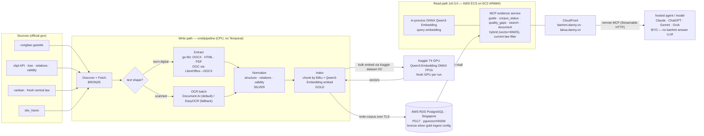

# banhmi architecture

banhmi is an **evidence-only RAG corpus + MCP server** for **banking & financial regulation** and
**technology law** affecting banking/finance (AI, data protection, cybersecurity, e-transactions,
cloud, payments, digital banking, outsourcing, technology operations)
— **multi-jurisdiction**: one codebase, **one corpus per country** in that country's binding legal
language. Live: **Vietnam** (`banhmi`) and **Malaysia** (`laksa`); **Indonesia** (`rendang`) is dormant
(decommissioned 2026-07-11, code kept); Thailand/Singapore are proposed — registry + playbook in [`docs/design/jurisdictions/`](design/jurisdictions/README.md). It
crawls each country's official government/regulator sources, extracts and normalizes documents into a
trustworthy, citable knowledge base — exact native citations (VN **Điều/Khoản**, MY
**Section/Subsection**, …), validity, amendment relations, provenance, and coverage gaps — and serves
that evidence over **MCP**.

**banhmi does not answer questions.** A **user-owned agent/model** (Claude.ai, ChatGPT, Gemini, Grok)
connects over MCP, retrieves exact citations/validity/relations/gaps, and decides the answer itself.
There is **no built-in answer LLM** — answering, if ever wanted, is a **separate microservice**.

**Deploy shape (split-cloud; repeats per country)** — see [Deployment](#deployment-mvp1):

1. **Write path — `cmd/pipeline`** (CPU, no Temporal): runs **locally now** (the dev machine egresses from a VN IP); the validated **self-terminating EC2 per country, in-country IP** infra (VN Hanoi Local Zone `ap-southeast-1-han-1a` — VN sources geo-lock non-VN IPs; MY `ap-southeast-5`) is parked for future refresh runs. Bulk embedding offloads to **Kaggle T4 GPU** (`embed.engine=kaggle`, dataset I/O, Qwen3-Embedding-0.6B ONNX FP16). Writes each country's corpus to **AWS RDS PostgreSQL** (Singapore `ap-southeast-1`) — **one database per country**.
2. **Read path (prod) — AWS:** CloudFront (per-country distribution) → ECS on EC2 ARM64 Graviton (same VPC as RDS), in-process ONNX Qwen3-Embedding query embedder; `GET /` serves a per-jurisdiction guide page.
3. **DB — AWS RDS PostgreSQL 17 + pgvector**, one DB per country (`banhmi`, `laksa`).
4. **Public endpoints:** **banhmi.danny.vn/mcp** (VN), **laksa.danny.vn/mcp** (MY); hosted agents connect over remote MCP (Streamable HTTP).

Conventions and the canonical agent guide live in [`CLAUDE.md`](../CLAUDE.md); the roadmap and current
phase in [`PLAN.md`](../PLAN.md). This doc is the **system-design overview**; deep dives live in
[`docs/design/`](design/).

## Design principles

| Principle | What it means |
|-----------|---------------|
| **Evidence-only, MCP-first** | banhmi exposes citations, validity, relations, provenance, and gaps over MCP. The user's model answers; banhmi never synthesizes an answer or calls an answer LLM. |
| **Data accuracy is the product** | Good data + any decent model = good answers; bad data = confidently wrong legal answers. INPUT (the corpus) is the hard, valuable part; OUTPUT is retrieval + the MCP tools. |
| **Hybrid retrieval (embedder required)** | Retrieval is dense Qwen3-Embedding-0.6B vectors + BM25 sparse vectors (pgvector `sparsevec`) over pgvector, RRF-fused with a deterministic query router, under a current-law filter. The embedder is **mandatory**, not optional; `pg_search`/ParadeDB BM25 is not used (unavailable on managed RDS). |
| **Write path CPU, read path migrating to AWS** | Write path is `cmd/pipeline` (CPU, no GPU, no Temporal) on self-terminating in-country EC2 (VN geo-lock); bulk embedding offloads to Kaggle T4 GPU (dataset I/O). Read path (current): GCP Cloud Run; **v0.3.0** migrates to AWS CloudFront + ECS on EC2 ARM64 Graviton (same VPC as RDS, no cross-cloud latency). DB port is open to `0.0.0.0/0` but TLS-required + password-gated (public legal corpus). Validate dev locally first, then deploy. |
| **Legal accuracy and provenance** | Prefer deterministic, extractive text — **no AI as the canonical parser**. Every chunk cites its exact Điều/Khoản; OCR is gated/flagged and never the sole source of binding text. Never present repealed/superseded/not-yet-effective text as current. |
| **Medallion + ingest, don't infer** | Bronze (raw) → Silver (normalized) → Gold (RAG); layers communicate through the database, not Go imports. When a source already exposes legal structure or amendment relations, ingest them directly. |
| **Pluggable, podman-first** | Sources, extractors, embedders, and retrievers are config-selected interfaces (no hardcoded vendor); all infrastructure and extraction engines run as OCI containers, no host installs. |
| **Multi-jurisdiction by config** | A jurisdiction is a config dimension (`BANHMI_JURISDICTION`), never a fork: shared pipeline/extract/RAG/MCP core; per-country source set, structure parser, citation labels, scope vocabulary, MCP brief. **The Postgres database is the jurisdiction boundary** (one DB per country). One binding language per country; banhmi never translates legal text. See the [jurisdiction playbook](design/jurisdictions/PLAYBOOK.md). |

## Data sources

Every source is an official government/regulator site; each country brings its own set (registry in
[`design/jurisdictions/`](design/jurisdictions/README.md) — MY: agclom · bnm · sc, see
[`MALAYSIA.md`](design/jurisdictions/MALAYSIA.md)). **Vietnam**, the reference jurisdiction, uses four
(per-source crawl/filter/download in [`docs/design/SOURCES.md`](design/SOURCES.md)):

| Source | Operator | Access | Primary text (RAG quality) | Relations / validity |
|--------|----------|--------|----------------------------|----------------------|
| congbao.chinhphu.vn | Văn phòng Chính phủ (Official Gazette) | Server-rendered HTML + CDN file download | Born-digital **PDF + DOCX** (9/10) | Partial ("sơ đồ") |
| vbpl.vn | Bộ Tư pháp (national VBQPPL DB) | **JSON API** (moj gateway) | **HTML** body (9/10) + **provision tree** (Chương/Điều/Khoản) | **Full graph** `references[]` + `effStatus`/`effFrom`/`effTo` |
| vanban.chinhphu.vn | Văn phòng Chính phủ (Hệ thống văn bản) | Server HTML (ASP.NET postback) + CDN file download | Born-digital **PDF/DOCX** via go-fitz | Shallow (from text); freshest central-law feed |
| sbv.hanoi.gov.vn | Ngân hàng Nhà nước (SBV Region 1 portal) | Server-rendered Liferay HTML + `/documents/` file download | Official **PDF/DOCX** via go-fitz (DOC via LibreOffice) | Shallow (parsed from text) |

- **All four are authoritative.** banhmi preserves their DOCX/DOC/PDF/HTML evidence. For parsing quality,
  Extract chooses DOCX → HTML → DOC-as-PDF → PDF/OCR; for metadata, **vbpl** provides the richest
  structure, relations, and validity.
- **SBV scope is reliable:** congbao category `c7`; vbpl agency id `62` (`NHNN`); `sbv.hanoi` is SBV-only by construction.
- **Roles:** congbao carries only gazetted documents; vbpl adds non-gazetted circulars, validity, and the
  amendment graph; **vanban** surfaces fresh central laws **before vbpl indexes them**; **SBV Hanoi** is a
  supplementary sweep **after vbpl** that fills official SBV file gaps. Use all four and **deduplicate by
  số ký hiệu**.
- This is public government legal data; crawl politely — see [Crawler etiquette](#crawler-etiquette-and-compliance).

## Data architecture (Medallion)

Full data model in [`docs/design/SCHEMA.md`](design/SCHEMA.md). Five schemas:

| Layer | Schema | Contents | Representative tables |
|-------|--------|----------|------------------------|
| Bronze | `bronze` | Raw, source-of-truth as crawled. One row per source observation. | `source_document`, `raw_payload`, `raw_file` |
| Silver | `silver` | Normalized: extracted Markdown, legal structure, deduplicated metadata, topics, **validity intervals + amendment events + relations**. | `document`, `document_section`, `validity_period`, `amendment_event`, `document_relation` |
| Gold | `gold` | RAG-ready: structure-aware chunks + Qwen3-Embedding embeddings (pgvector). | `chunk`, `chunk_embedding` |
| Ingest | `ingest` | Pipeline state: per-(source,keyword) cursors + watermarks, the fetch ledger with crash-safe leases and dead-letter, discovery provenance. Completeness is `done == expected`, never a flag. | `discover_cursor`, `fetch_doc`, `fetch_artifact`, `doc_discovery` |
| Config | `config` | Operator-tunable vocabularies (scope terms, issuer codes, discovery keywords). Seeded from CSVs; read at startup. | — |

Legal documents are **immutable once published** — what changes is **validity** (in force → amended →
repealed/suspended) and **relations** (a new document acts on it). banhmi tracks effective-dated validity
intervals + first-class amendment events, not SCD snapshots. MVP1 implements **document-level validity +
a current-law filter** (`in_force` + `partial`); **clause-level currency is surfaced as evidence**
(verbatim amending clauses + `incoming_amendments[]` on the `document` tool), not derived by banhmi
(see [`PLAN.md`](../PLAN.md)).

## Datastores

RAG vectors live in PostgreSQL via **pgvector** — one datastore for the corpus and vectors, no separate
vector DB. Retrieval is **hybrid**: dense Qwen3-Embedding-0.6B + BM25 **sparse vectors**, both in
pgvector — one datastore, no separate search engine. `pg_search`/ParadeDB is not used (it can't run on
managed RDS).

| Store | Holds | Notes |
|-------|-------|-------|
| PostgreSQL + pgvector — per-country DB (`banhmi`/`laksa`) | `bronze`/`silver`/`gold`/`ingest`/`config` schemas, chunks, embeddings | HNSW (cosine) ANN; embeddings keyed by `(chunk_id, model, dims)` so embedders coexist |
| Object storage — local volume + per-region S3 file cache (v0.3.0); GCS `danny-banhmi-docai` for the Document AI cache | Raw files (PDF/DOCX/DOC), OCR I/O | Blobs do not belong in Postgres; `bronze` references them by path + content hash |

Dev default: a **single PostgreSQL server (pgvector image)** hosts all country DBs — one container,
clean logical separation. banhmi's corpus (tens of thousands to low millions of chunks) sits well within
pgvector + HNSW; a dedicated vector DB is only worth it at much larger scale.

## Pipeline

Whole system at a glance: the `cmd/pipeline` ingestion pipeline writes the corpus to the cloud DB, and
the MCP read-path service reads it back for hosted agents. The two flows in detail (ingestion's write
path, serving's read path, with per-stage DB I/O) live in [`docs/design/PIPELINE.md`](design/PIPELINE.md).


```mermaid
graph LR
  subgraph Sources["Sources (official gov)"]
    CB["congbao gazette"]
    VB["vbpl API · tree · relations · validity"]
    VBN["vanban · fresh central law"]
    SH["sbv_hanoi"]
  end

  subgraph Write["Write path — cmd/pipeline (CPU, no Temporal)"]
    Crawl["Discover + Fetch<br/>BRONZE"] --> Route{"text shape?"}
    Route -- born-digital --> T0["Extract<br/>go-fitz: DOCX · HTML · PDF<br/>DOC via LibreOffice→DOCX"]
    Route -- scanned --> OCR["OCR batch<br/>Document AI (default) / EasyOCR (fallback)"]
    T0 --> Norm["Normalize<br/>structure · relations · validity<br/>SILVER"]
    OCR --> Norm
    Norm --> Idx["Index<br/>chunk by Điều + Qwen3-Embedding embed<br/>GOLD"]
  end

  CB --> Crawl
  VB --> Crawl
  VBN --> Crawl
  SH --> Crawl

  Idx -- "bulk embed via Kaggle dataset I/O" --> GPU["Kaggle T4 GPU<br/>Qwen3-Embedding ONNX FP16<br/>fresh GPU per run"]
  GPU -- "vectors" --> Idx

  Idx -- "write corpus over TLS" --> DB[("AWS RDS PostgreSQL · Singapore<br/>PG17 · pgvector/HNSW<br/>bronze·silver·gold·ingest·config")]

  subgraph Read["Read path (v0.3.0 — AWS ECS on EC2 ARM64)"]
    MCP["MCP evidence service<br/>guide · corpus_status · quality_gaps · search · document<br/>hybrid (vector+BM25), current-law filter"]
    EMB["in-process ONNX Qwen3-Embedding<br/>query embedding"]
    EMB --- MCP
  end

  DB -- "vector read" --> MCP
  MCP --- CF["CloudFront<br/>banhmi.danny.vn · laksa.danny.vn"]
  CF -- "remote MCP (Streamable HTTP)" --> AGENT["hosted agent / model<br/>Claude · ChatGPT · Gemini · Grok<br/>BYO — no banhmi answer LLM"]
```

## Pipeline stages

Six stages called directly by `cmd/pipeline` (no Temporal); the `ingest` ledger is the durable queue and
handoff bus. Full design — granularity, schedules, idempotency, anti-patterns — in
[`docs/design/PIPELINE.md`](design/PIPELINE.md).

- **Discover** — surfaces in-scope new documents and enqueues them, scope-filtered by
  [`pkg/scope`](../pkg/scope) (see [`docs/design/SOURCES.md`](design/SOURCES.md)): congbao RSS/listings +
  vbpl `doc/all` keyword search + the relation graph for cross-cutting laws + the vanban central-law
  listing.
- **Fetch** — a batch drainer (per source, concurrency-capped) that claims pending artifacts
  (`FOR UPDATE SKIP LOCKED` + lease), downloads official DOCX/PDF, and enriches from vbpl (provision
  tree, relations, validity, topics). Writes raw Bronze, **idempotent on `content_hash`**; stops at
  Bronze and does not start Extract.
- **Extract** — per-document stage that writes Silver document text.
- **Normalize** — per-document stage that writes section trees, validity, and relations.
- **Index** — per-document stage that writes Gold chunks + Qwen3-Embedding embeddings (bulk embedding offloaded to Kaggle T4 GPU).
- **LexIndex** — builds BM25 sparse vectors (`gold.chunk.content_sparse`) for the hybrid retrieval lexical arm.

Concurrency is stage-specific: Discover/Fetch are capped by external API/download limits;
Extract/Normalize/Index are capped at `cores - 2`.

## Repository layout

`cmd/` entrypoints, self-contained packages under `pkg/`, generated SQL isolated, blank-import
selectivity for sources.

```text
banhmi/
├── cmd/
│   ├── pipeline/          # pipeline runner: discover/fetch/extract/normalize/index/lexindex stages
│   ├── server/            # Cloud Run deploy surface: mounts the Streamable-HTTP MCP transport at /mcp
│   ├── mcp/               # MCP server (stdio) for local agent clients
│   ├── ingest/            # one-shot crawl/discover driver
│   ├── migrate/           # apply DB migrations
│   ├── seed/              # load config vocabularies from deploy/seed/*.csv
│   ├── eval/              # retrieval eval (recall@k/MRR@k), no LLM
│   └── banhmi/            # operator CLI: trigger crawl, reindex, backfill, status
├── pkg/
│   ├── base/              # shared primitives only (config, db, log, jurisdiction)
│   ├── app/               # composition root: dig container + providers (per cmd); wires the sources
│   ├── scope/             # crawl-scope matcher: DB-seeded terms
│   ├── ingest/            # BRONZE: one self-contained package per source (VN: congbao, vbpl, vanban, sbvhanoi; MY: agclom, bnm, sc; ID: bpk, bi; phapluat dropped for MVP1)
│   ├── fetch/             # shared browser-impersonating HTTP client (utls Chrome TLS + WAF cookie minters)
│   ├── extract/           # BRONZE → SILVER text: deterministic (go-fitz) first, Document AI / EasyOCR OCR fallback
│   ├── pipeline/          # pipeline stages: activity methods for discover/fetch/extract/normalize/index
│   ├── rag/               # GOLD/serving: embed (Qwen3-Embedding), retrieve (hybrid: vector+BM25 sparse), ocr (batch)
│   ├── mcp/               # MCP tools + resources over the shared query core (the product surface)
│   └── store/             # generated sqlc packages (do not hand-edit)
├── sql/                   # sqlc: schema.sql + queries.sql per schema (bronze/silver/gold/ingest/config)
├── deploy/                # compose/Quadlet, Containerfiles, migrations, seed CSVs
├── config/                # config.example.yaml + profiles
├── docs/
│   ├── README.md          # documentation index
│   ├── ARCHITECTURE.md    # this document
│   └── design/            # SOURCES, PIPELINE, SCHEMA, EXTRACTION, RAG + jurisdictions/ (registry, playbook, per-country)
├── tools/                 # custom lint/codegen (schemalint, migragen)
├── CLAUDE.md              # canonical agent guide
├── PLAN.md
├── LICENSE                # Apache 2.0
└── README.md
```

> **No answer path:** the former answer LLM (`pkg/llm`) and its surfaces — `pkg/rag/answer`, the
> OpenAI-compatible chat endpoint (`pkg/api`), and the web "ask" UI (`pkg/web`) — are removed; banhmi
> serves evidence only.

## MCP — the product surface

MCP is the **primary and only** query surface: the deployed agent contract. A connecting model must be
able to discover corpus status, search evidence, open exact documents, and understand gaps **through MCP
alone**. Built on the official Go MCP SDK (`github.com/modelcontextprotocol/go-sdk`).

**Tools:** `guide`, `corpus_status`, `quality_gaps`, `search`, `document`. Each `search`/`document` hit
carries exact Điều/Khoản citations, validity badges, confirmed relations, provenance, and explicit gaps.
There is **no `ask` tool** — banhmi serves evidence, the user's model answers.

| Command | Role |
|---------|------|
| `cmd/pipeline` | Pipeline runner. Calls activity methods directly for discover/fetch/extract/normalize/index/lexindex. Structured slog output. |
| `cmd/mcp` | Serves the MCP tools over **stdio** for local agent clients (e.g. Claude Desktop). |
| `cmd/server` | The **remote** surface: mounts the SDK's `StreamableHTTPHandler` at `/mcp` for hosted agents. **Live** (shipped 2026-06-01); public by default, opt-in API key. |
| `cmd/migrate` | Applies pending migrations. |
| `cmd/banhmi` | Operator CLI: trigger a crawl or backfill, reindex, inspect pipeline state. |
| `cmd/ingest` | One-shot crawl/discover driver. Sources are wired in the composition root (`pkg/app`), not via a blank-import registry. |

Retrieval/citation/evidence logic lives in the shared core (`pkg/rag`, `pkg/mcp`), not in a surface, so
stdio and Streamable-HTTP expose the same evidence.

## Extraction

Accuracy-first; **no AI as the canonical parser**. Path chosen per document by a born-digital detector;
full cascade and the per-file gate in [`docs/design/EXTRACTION.md`](design/EXTRACTION.md).

- **Cascade:** DOCX → HTML body → legacy DOC → PDF, all extracted by **go-fitz** (MuPDF via purego,
  zero-Python, no CGO). Legacy `.doc` goes through LibreOffice `soffice --headless --convert-to docx`,
  then go-fitz on the resulting DOCX. OCR (run as a batch — `OcrAll`) is the floor for scanned or
  gate-failing PDFs. The default OCR engine is **GCP Document AI** Enterprise OCR (`ocr.engine: documentai`,
  `pkg/extract/docai/`); **EasyOCR** (per-jurisdiction language, local CPU or Kaggle GPU) remains available
  as the `auto`/`local`/`kaggle` engine.
- **Per-file gate:** Extract extracts, then **checks the result** (diacritic ratio, replacement-char
  ratio, dictionary/OOV hit, length vs page count) and accepts only passing text; garbled or
  text-layerless PDFs route to OCR. The route is recorded per document (`source`, `confidence`).
- go-fitz is **in-process** (pure Go via purego) — no sidecar, no Python; EasyOCR runs as a separate
  **batch** (local CPU or Kaggle GPU), never inline. AGPL-3.0 for go-fitz/MuPDF is fine (batch worker,
  not a network service; repo is public). **NFC** is a hard invariant; OCR text is **never the sole
  source of binding legal text**. Gemma 4 E4B OCR enhancement is **MVP2, deferred**.

## RAG and evidence

Chunking, retrieval evidence, gaps, and eval in [`docs/design/RAG.md`](design/RAG.md).

- **Chunking:** structure-aware, by Điều, using the provision tree where available (vbpl). Each chunk
  carries its citation path **and a deterministic contextual prefix** (số ký hiệu + title + Chương/Mục +
  effective date) assembled from the structure tree — Anthropic-style contextual retrieval, no LLM cost.
- **Retrieval is hybrid:** dense Qwen3-Embedding-0.6B over pgvector (HNSW, cosine) + **BM25 sparse vectors** (pgvector
  `sparsevec`, built by `cmd/lexindex`), RRF-fused with a **deterministic query router** (boost lexical
  only for diacritic-less / số-ký-hiệu queries), behind a **current-law pre-filter** (keeps `in_force` +
  `partial`). The embedder is **mandatory**; the lexical arm is native pgvector (no `pg_search` — it can't
  run on managed RDS). A cross-encoder reranker remains eval-only. Each hit returns both the dense
  similarity and the BM25 score. Retrieved hits also carry confirmed `document_relation` edges (separate
  from ranked chunks) so the user's model sees amendment/replacement context without treating edges as text.
- **Evidence, not answers:** MCP exposes ranked hits + validity badges + relations + provenance +
  explicit gaps; the user's model decides the answer.
- **Evaluation (gates changes):** a golden set (queries → expected document + Điều/Khoản) with
  adversarial slices. `cmd/eval -retrieval-only -retrieval-mode bm25|vector|hybrid` scores recall@k/MRR@k
  **without any LLM**; `hybrid` is the production mode. The query-routed hybrid beats vector-only on eval
  (recall@k 85.7%→89.3%, mrr 78.6%→84.6%, current-law 100%, no regression); naive equal-weight RRF had
  regressed, so the router boosts lexical only where the dense vector is weak.

## Deployment (MVP1)

Shipped **2026-06-01** (VN; MY 2026-06-22; ID 2026-07-06). **The shape repeats per country:** one
Postgres database + one MCP service + one public domain per jurisdiction, selected by
`BANHMI_JURISDICTION` + `BANHMI_DATABASE_NAME` (fan-out mechanics in the
[jurisdiction playbook](design/jurisdictions/PLAYBOOK.md#deploy-fan-out-mechanics)).

- **Write path — `cmd/pipeline`** (CPU, no Temporal). Runs on **self-terminating EC2 per country,
  in-country IP** (VN **Hanoi Local Zone** `ap-southeast-1-han-1a` — VN sources geo-lock non-VN IPs;
  MY `ap-southeast-5`; ID `ap-southeast-3`), or locally for dev. Extraction is go-fitz (in-process,
  zero-Python). Bulk embedding offloads to **Kaggle T4 GPU** (`embed.engine=kaggle`, dataset I/O,
  Qwen3-Embedding-0.6B ONNX FP16; free, fresh GPU per run). File cache in per-region **S3**
  (`danny-banhmi-data-{vn,my,id}`); image via **CodeBuild → ECR**; write-path secrets in **SSM
  Parameter Store**. Pipeline writes the corpus **over TLS to RDS**.
- **Database — AWS RDS PostgreSQL 17 + pgvector/HNSW** (Singapore `ap-southeast-1`), one DB per country
  (`banhmi`, `laksa`), one datastore for both dense vectors and BM25 sparse vectors. The
  Postgres port is reachable from `0.0.0.0/0` but **TLS-required (`rds.force_ssl=1`) + password-gated**
  (the corpus is public legal text). No ParadeDB/`pg_search` (unavailable on managed RDS) — the lexical
  arm is native pgvector `sparsevec`, so hybrid stays single-datastore.
- **Read path (prod) — AWS** (`ap-southeast-1`). CloudFront per country → ECS on one EC2 Graviton
  in the RDS VPC; X-Origin-Verify enforced at the origin. Public endpoints: `banhmi.danny.vn/mcp`,
  `laksa.danny.vn/mcp` (GCP Cloud Run + Firebase retired 2026-07-12).
- **Read path (v0.3.0) — AWS** (`ap-southeast-1`). **CloudFront** (2 distributions, ACM TLS) +
  **ECS on EC2 t4g.medium** (2 vCPU / 4 GB, ARM64 Graviton, Elastic IP). Three MCP containers
  (one per country) with **in-process ONNX Qwen3-Embedding-0.6B FP16** query embedder; FP16 external
  data format allows mmap weight sharing across containers. Always-on, same VPC as RDS — eliminates
  cross-cloud latency and cold starts. Firebase Hosting is replaced by CloudFront.
- **Region co-location:** RDS and ECS both in `ap-southeast-1` (Singapore); same VPC, sub-ms DB
  round-trip.

> **History:** **Neon** was the original DB choice (decided 2026-05-31); switched to **AWS RDS** because
> Neon's 512 MB free-tier cap overflowed mid-restore. The Cloud Run query embedder moved from a planned
> **OVMS CPU sidecar** to **in-process OpenVINO** (now being replaced by in-process ONNX on AWS).
> **2026-06-13 — Cloud Run NAT removed** to keep idle cost ~$0 (opened RDS SG to `0.0.0.0/0`,
> TLS-required + password-gated). **2026-07-06 — Temporal removed;** `cmd/pipeline` calls activity
> methods directly.

## Technology stack

| Concern | Choice |
|---------|--------|
| Language | Go 1.26 (module `danny.vn/banhmi`) |
| Database | **Local dev:** PostgreSQL 17 + pgvector (one container, per-country DBs) — matches prod. **Cloud (deployed):** AWS RDS PostgreSQL 17 + pgvector/HNSW, Singapore. Lexical arm is native `sparsevec` BM25 — no `pg_search`/ParadeDB anywhere. |
| Object storage | Local volume + per-region S3 file cache (v0.3.0) for raw PDF/DOCX/DOC; GCS for embed batch I/O + OCR cache |
| Data access | sqlc (typed), no ORM |
| Migrations | Atlas diff → goose-format SQL (runtime apply) |
| Orchestration | Direct pipeline stages (`cmd/pipeline`), no Temporal |
| Config / secrets | YAML + env; secrets via env / file / Vault (pluggable) |
| Logging | `log/slog` |
| Query surface | MCP server (official Go MCP SDK) — stdio local, Streamable-HTTP remote (Cloud Run, migrating to ECS) |
| Embeddings | **required** self-hosted Qwen3-Embedding-0.6B (ONNX FP16) — Kaggle T4 GPU for bulk (dataset I/O); in-process ONNX Runtime for queries (built `-tags onnx`) |
| Extraction / OCR | go-fitz (MuPDF via purego, zero-Python) + LibreOffice DOC bridge + **GCP Document AI** Enterprise OCR (default batch engine; `ocr.engine: documentai`) or EasyOCR (per-jurisdiction language, `auto`/`local`/`kaggle`) as a batch fallback |
| Containers | podman / podman-compose / Quadlet; Containerfiles |
| License | Apache 2.0 |

## Crawler etiquette and compliance

The data is public government legal text, but source sites disallow `/api/` in `robots.txt`. banhmi is
published for others to run, so crawler defaults are conservative and configurable:

- Descriptive User-Agent identifying the deployment; pipeline concurrency caps for fetch,
  off-peak scheduling, exponential backoff on 429/5xx.
- Respect cache headers; prefer incremental discovery (cursors/watermarks) over full re-crawls.
- Keep raw payloads and source URLs for provenance and auditability.
- Document the compliance posture in the README so operators make an informed choice.

## Settled decisions

1. **Orchestration — decided: `cmd/pipeline` direct calls.** Temporal removed (2026-07-06). The
   pipeline calls activity methods directly with structured slog output; the `ingest` ledger provides
   crash-safe queuing and idempotency.
2. **Embeddings — decided: Qwen3-Embedding-0.6B ONNX FP16** everywhere. Kaggle T4 GPU for bulk
   (dataset I/O); in-process ONNX Runtime for queries. No BM25-only fallback; no user-facing model override.
3. **Cloud shape — migrating to AWS (v0.3.0).** DB already on AWS RDS; read path moving from GCP Cloud
   Run to AWS CloudFront + ECS on EC2 ARM64 Graviton (same VPC as RDS). Open within this:
   public-endpoint auth (API key shipped, OAuth later).
4. **Extra source — deferred.** Add `sbv.gov.vn` for non-gazetted SBV circulars/drafts? Later phase.
