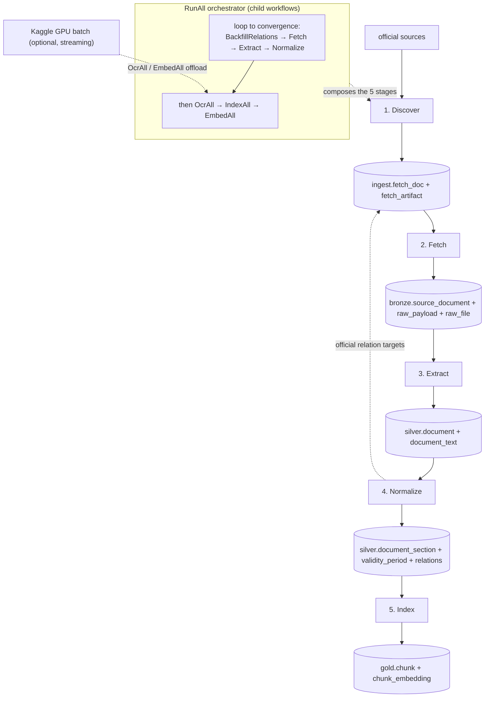
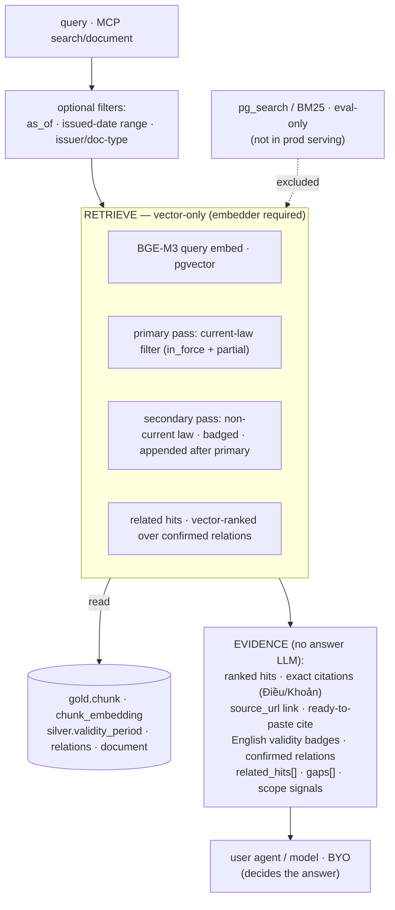

# Pipeline — data flows & workflows

banhmi is two flows. **Ingestion (INPUT)** crawls, parses, and saves a trustworthy corpus; **serving
(OUTPUT)** is the MCP evidence service — it retrieves and exposes evidence, it does not answer.
**Evidence quality is capped by ingestion quality** — serving can only retrieve and cite what ingestion
captured correctly, so INPUT comes first (see [`PLAN.md`](../../PLAN.md)).

High-level overview: [`ARCHITECTURE.md`](../ARCHITECTURE.md); tables in [`SCHEMA.md`](SCHEMA.md); per-source
access in [`SOURCES.md`](SOURCES.md); parsing in [`EXTRACTION.md`](EXTRACTION.md); retrieval in
[`RAG.md`](RAG.md).

## Ingestion (INPUT) — five Temporal stages

Temporal runs five main pipeline workflows plus one bounded relation-backfill helper. **Each stage is a
separate workflow; no stage auto-starts the next** — the database ledger is the handoff.

**Five stages only:** `Discover` → `Fetch` → `Extract` → `Normalize` → `Index`.

- **Discover** finds documents and writes the fetch ledger.
- **Fetch** downloads Bronze artifacts only.
- **Extract** turns one completed fetched document into Silver text.
- **Normalize** turns Silver text / VBPL tree into sections, validity, and relations.
- **Index** turns normalized sections into Gold chunks and BGE-M3 embeddings (required).
- **BackfillRelations** is not a stage; it only enqueues promoted official relation targets for a later
  Fetch pass.

**`RunAll`** is the orchestrator that composes these stages as **child workflows** for a one-shot or
scheduled whole-corpus run: discover every enabled `(source, keyword)` slice, then loop
`BackfillRelations → FetchAll → ExtractAll → NormalizeAll` to convergence (capped at `MaxRounds=3` =
relation depth; `MaxArtifacts=0` so each round drains the whole fetch queue), then `OcrAll → IndexAll →
EmbedAll`. Operators turn the pipeline on by un-pausing the single paused **`pipeline:run-all`** schedule
(daily); run it once locally with `cmd/worker -run-all`. `RunAll` only sequences the stages — all logic
stays in the stage workflows, which remain independently runnable.

The two Kaggle batch stages stream both ends so memory stays bounded regardless of corpus size:
`EmbedAll`/`OcrAll` write input rows straight to the upload JSONL from a DB cursor and upsert each
result as it streams back from the downloaded output (never materializing the whole input or output).
Each Kaggle batch uses a unique per-run kernel slug so concurrent/retried runs never collide.

The database ledger is the handoff between stages; no stage auto-starts the next. `RunAll` composes
them as child workflows. Bulk `OcrAll`/`EmbedAll` may offload to a streaming Kaggle GPU batch; the
query-time embedder always stays local.

### Discover

- **Trigger:** hourly schedule per discovery slice: source plus optional keyword.
- **Granularity:** thin workflow, one or two activities, no children.
- **Writes:** `ingest.fetch_doc`, `ingest.fetch_artifact`, `ingest.doc_discovery`,
  `ingest.discover_cursor`.
- **Idempotency:** `fetch_doc (source, external_id)` and cursor watermarks.

Current slices:

| Source | Slices |
|--------|--------|
| `congbao` | 1 RSS sweep |
| `vbpl` | 1 agency sweep + configured keyword searches |
| `sbv_hanoi` | 1 broad sweep after VBPL; skip duplicate `Số/Kí hiệu`, then local-filter with VBPL discovery keywords |

### Fetch

- **Trigger:** frequent schedule per source, or manual `cmd/worker -fetch <source>`.
- **Granularity:** scheduled batch drainer over `fetch_artifact`.
- **Concurrency:** at most 5 activities in flight by default, enforced by the worker activity limit
  (`cmd/worker -max`). Fetch has no second source/workflow limiter.
- **Writes:** `bronze.source_document`, `bronze.raw_payload`, `bronze.raw_file`; updates artifact/doc
  state and counters.
- **Boundary:** Fetch never starts Extract. A completed doc stays in Bronze until `Extract` is run.

Fetch claims pending artifacts with `FOR UPDATE SKIP LOCKED` + lease. Each `body`, `tree`, or `file`
artifact is one retryable activity.

### Extract

- **Trigger:** explicit per-document workflow, `cmd/worker -extract <fetch_doc_id>` or
  `cmd/worker -extract-all`.
- **Input:** completed `ingest.fetch_doc` id.
- **Backfill scope:** `ExtractAll` enumerates only completed in-scope docs that still need extracted
  text, plus completed source observations missing a `document_alias` link to an existing Silver
  document. A no-file doc runs once so Silver can record review state; manual `-extract` is the force
  re-run path.
- **Cascade:** DOCX → text-bearing HTML body → DOC rendered to PDF → PDF/MarkItDown/OCR.
- **VBPL source-unavailable fallback:** if VBPL extraction proves the source body/file is a placeholder
  or empty, Extract searches Congbao by exact normalized `Số/Kí hiệu` and enqueues the matching Congbao
  `fetch_doc` only when the issued date/type are compatible and an official PDF/DOC/DOCX exists.
- **Writes:** `silver.document`, `silver.document_text`.
- **Boundary:** Extract does not Normalize or Index. OCR can happen only in this stage, never during
  Discover or Fetch.

### Normalize

- **Trigger:** explicit per-document workflow, `cmd/worker -normalize <fetch_doc_id>` or
  `cmd/worker -normalize-all`.
- **Input:** Silver document text and available VBPL provision tree.
- **Backfill scope:** `NormalizeAll` enumerates only completed in-scope docs with a Silver document but
  no current document-level validity marker. `cmd/worker -normalize-all -force` is the explicit
  maintenance path for deterministic re-parse/relation repair after Normalize logic changes.
- **Writes:** sections, validity periods, and relation evidence in Silver.
- **Relation backfill:** promoted official VBPL `references[]` targets from matched corpus docs enqueue
  `fetch_doc` rows with `provenance='relation'`. Exact source targets are keyed by
  `source:external_id`; normalized `số hiệu` is only a fallback when no source target ID exists.
  Relation-fetched leaves do not expand their own references; no backfill-from-backfill.
- **Boundary:** Normalize does not Extract or Index.

`cmd/worker -backfill-relations` runs the same enqueue logic over existing unresolved relation stubs.

### Index

- **Trigger:** explicit per-document workflow, `cmd/worker -index <fetch_doc_id>` or
  `cmd/worker -index-all`.
- **Input:** normalized Silver sections.
- **Backfill scope:** `IndexAll` enumerates only normalized docs with current sections and no Gold chunk
  tied to those current section rows. `cmd/worker -index-all -force` is the explicit maintenance path
  for deterministic re-chunk/re-embed passes after index logic changes.
- **Writes:** Gold chunks and BGE-M3 embeddings (required).
- **Boundary:** Index does not Extract or Normalize.

### Scheduling

- **Paused by default:** schedules are created paused so a fresh deployment does not crawl until the
  operator opts in.
- **Overlap policy:** `Skip` for Discover and Fetch schedules.
- **Catchup window:** small; watermarks and ledgers self-heal missed ticks.
- **Fetch concurrency:** Temporal worker/activity limits are the only fetch backpressure control.

Only Discover and Fetch schedules are created today. Extract, Normalize, and Index remain explicit
until the corpus quality gates are validated.

### Handoff

| Edge | Mechanism |
|------|-----------|
| Discover → Fetch | ledger rows in `ingest.fetch_artifact` |
| Fetch → Extract | operator/schedule selects completed `fetch_doc.id` |
| Extract → Normalize | operator/schedule selects extracted `fetch_doc.id` |
| Normalize → Index | operator/schedule selects normalized `fetch_doc.id` |
| Normalize → relation Fetch | relation target rows are enqueued; a later Fetch run drains them |

There is no hidden Temporal child edge between stages.

## Serving (OUTPUT) — query → retrieve → evidence (over MCP)

Read path. On demand (the MCP server), no Temporal. Chunking/retrieval/evidence design: [`RAG.md`](RAG.md).

Production retrieval is **vector-only** (BGE-M3 over pgvector); `pg_search`/BM25 and the reranker exist
only for local eval and are not wired into the serving path. By default the primary pass returns
current-law chunks (`in_force`/`partial`) and a small secondary pass appends non-current law **badged**
after — so repealed/overlapping law stays findable without crowding current law out of the primary
ranking. `InForceOnly=true` restricts to current only; a scoped query (`as_of`, issuer, etc.) skips
the non-current pass. Output is content + source links only — never files. Non-binding or `needs_review`
text stays in Silver for audit and does not become normal answerable chunks.

## Why INPUT before OUTPUT

Each serving step depends on an ingestion step being correct:

| Serving step | needs ingestion to have… | else → |
|--------------|--------------------------|--------|
| retrieve the right chunk | faithful extraction + sane chunks | can't surface what wasn't captured |
| cite exact Điều/Khoản | a correct section tree | citation points to the wrong place |
| current-law filter / badge | validity status (`in_force` + `partial`) | misses partly-current law or cites repealed law as current |
| expose "what amends this?" | the relation graph | shallow / empty relation evidence |

## Deferred

- **Watchdog:** re-open incomplete docs, recover expired leases, and refresh expiring URLs.
- **Orchestrator:** a small explicit workflow may later call the five stages in order for production.
- **GPU queues:** Index embeddings or OCR enhancement may move to dedicated task queues later.
