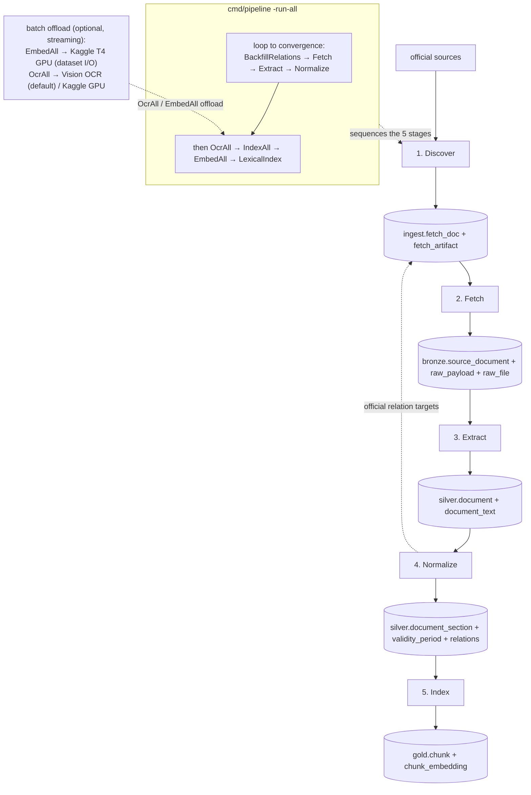
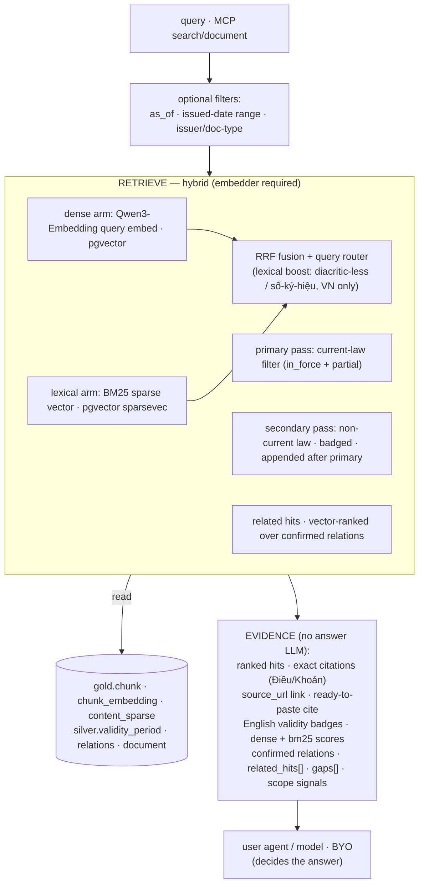

# Pipeline — data flows & workflows

banhmi is two flows. **Ingestion (INPUT)** crawls, parses, and saves a trustworthy corpus; **serving
(OUTPUT)** is the MCP evidence service — it retrieves and exposes evidence, it does not answer.
**Evidence quality is capped by ingestion quality** — serving can only retrieve and cite what ingestion
captured correctly, so INPUT comes first (see [`PLAN.md`](../../PLAN.md)).

High-level overview: [`ARCHITECTURE.md`](../ARCHITECTURE.md); tables in [`SCHEMA.md`](SCHEMA.md); per-source
access in [`SOURCES.md`](SOURCES.md); parsing in [`EXTRACTION.md`](EXTRACTION.md); retrieval in
[`RAG.md`](RAG.md).

## Ingestion (INPUT) — five pipeline stages

`cmd/pipeline` runs five stages plus one bounded relation-backfill helper. **Each stage is a direct
method call; no stage auto-starts the next** — the database ledger is the handoff.

**Five stages only:** `Discover` → `Fetch` → `Extract` → `Normalize` → `Index`.

- **Discover** finds documents and writes the fetch ledger.
- **Fetch** downloads Bronze artifacts only.
- **Extract** turns one completed fetched document into Silver text.
- **Normalize** turns Silver text / VBPL tree into sections, validity, and relations.
- **Index** turns normalized sections into Gold chunks and Qwen3-Embedding vectors (required).
- **BackfillRelations** is not a stage; it only enqueues promoted official relation targets for a later
  Fetch pass.

**`-run-all`** is the flag that composes these stages for a one-shot whole-corpus run: discover every
enabled `(source, keyword)` slice, then loop `BackfillRelations → FetchAll → ExtractAll →
NormalizeAll` to convergence (capped at `MaxRounds=3` = relation depth; `MaxArtifacts=0` so each round
drains the whole fetch queue), then `OcrAll → IndexAll → EmbedAll → LexicalIndex` (BM25 sparse
rebuild, so hybrid retrieval stays current). Its source list comes from the wired source map
(`SourceIDs(a)`, a package-level function), so the same pipeline serves every jurisdiction. Run it with
`cmd/pipeline -run-all` (`-lexindex` runs the sparse rebuild alone). `-run-all` only sequences the
stages — all logic stays in the stage methods, which remain independently runnable via their own flags.

The two batch stages stream both ends so memory stays bounded regardless of corpus size:
`EmbedAll`/`OcrAll` write input rows straight to the upload JSONL from a DB cursor and upsert each
result as it streams back from the downloaded output (never materializing the whole input or output).
Each batch uses a unique per-run slug so concurrent/retried runs never collide.

```mermaid
flowchart TB
  SRC["official sources"] --> DISCOVER["1. Discover"]
  DISCOVER --> LEDGER[("ingest.fetch_doc + fetch_artifact")]
  LEDGER --> FETCH["2. Fetch"]
  FETCH --> BRONZE[("bronze.source_document + raw_payload + raw_file")]
  BRONZE --> EXTRACT["3. Extract"]
  EXTRACT --> TEXT[("silver.document + document_text")]
  TEXT --> NORMALIZE["4. Normalize"]
  NORMALIZE --> SECTIONS[("silver.document_section + validity_period + relations")]
  NORMALIZE -. "official relation targets" .-> LEDGER
  SECTIONS --> INDEX["5. Index"]
  INDEX --> GOLD[("gold.chunk + chunk_embedding")]

  subgraph RUNALL["cmd/pipeline -run-all"]
    direction LR
    LOOP["loop to convergence:<br/>BackfillRelations → Fetch → Extract → Normalize"]
    TAIL["then OcrAll → IndexAll → EmbedAll → LexicalIndex"]
    LOOP --> TAIL
  end
  RUNALL -. "sequences the 5 stages" .-> DISCOVER
  OFFLOAD["batch offload (optional, streaming):<br/>EmbedAll → Kaggle T4 GPU (dataset I/O)<br/>OcrAll → Vision OCR (default) / Kaggle GPU"] -. "OcrAll / EmbedAll offload" .-> TAIL
```

The database ledger is the handoff between stages; no stage auto-starts the next. `-run-all` sequences
them as direct calls. Bulk `EmbedAll` offloads to Kaggle T4 GPU (dataset I/O);
`OcrAll` offloads to Vision OCR (or Kaggle EasyOCR). The query-time embedder always stays in-process.

### Discover

- **Trigger:** `cmd/pipeline -discover` or as part of `-run-all`.
- **Granularity:** one method call per discovery slice.
- **Writes:** `ingest.fetch_doc`, `ingest.fetch_artifact`, `ingest.doc_discovery`,
  `ingest.discover_cursor`.
- **Idempotency:** `fetch_doc (source, external_id)` and cursor watermarks.
- **Full rescan:** `-discover <source|all> -force` ignores the stored watermark and re-takes the
  whole feed (upserts make repeats cheap); the cursor still advances after, so later runs return
  to incremental. Use after fixing a discovery bug or when a source backfills older documents.
- **Partial-failure contract:** a source whose Discover fans out over sub-units (bpk jenis, bnm
  sectors, sc sections) returns a non-nil error when ANY sub-unit fails, so the pipeline does not
  advance the cursor over documents it never saw. A swallowed sub-unit failure once cost bpk 304
  of 503 POJK — the cursor advanced past them and incremental runs never looked back.

Current slices (per jurisdiction — `BANHMI_JURISDICTION` selects the source set):

| Source | Jurisdiction | Slices |
|--------|-------------|--------|
| `congbao` | VN | 1 RSS sweep |
| `vbpl` | VN | 1 agency sweep + configured keyword searches |
| `vanban` | VN | 1 newest-first listing walk + `scope.Match` (6-month lookback past the watermark) |
| `sbv_hanoi` | VN | 1 broad portal sweep + `scope.Match` (cross-source overlap reconciles in silver) |
| `agclom` | MY | Acts + P.U. subsidiary legislation |
| `bnm` | MY | BNM policy documents & guidelines |
| `sc` | MY | SC technology guidelines |
| `bpk` | ID | **1 sweep over all 12 jenis** (POJK/SEOJK/BSSN/LPS/PPATK + UU/PP/Perpres/PMK/Kominfo/Komdigi), tahun-windowed incremental. **No keyword slices** — a keyword bypasses `scope.Match` and BPK's search filter is untrustworthy, so `Discover` rejects one ([why](SOURCES.md#bpk-discovery-id--sweep-only)) |
| `bi` | ID | BI regulations JSON API |

### Fetch

- **Trigger:** `cmd/pipeline -fetch` or as part of `-run-all`.
- **Granularity:** batch drainer over `fetch_artifact`.
- **Concurrency:** capped by external API/download limits.
- **Writes:** `bronze.source_document`, `bronze.raw_payload`, `bronze.raw_file`; updates artifact/doc
  state and counters.
- **Boundary:** Fetch never starts Extract. A completed doc stays in Bronze until `Extract` is run.

Fetch claims pending artifacts with `FOR UPDATE SKIP LOCKED` + lease. Each `body`, `tree`, or `file`
artifact is one retryable activity.

### Extract

- **Trigger:** `cmd/pipeline -extract-all` or as part of `-run-all`.
- **Input:** completed `ingest.fetch_doc` id.
- **Backfill scope:** `ExtractAll` enumerates only completed in-scope docs that still need extracted
  text, plus completed source observations missing a `document_alias` link to an existing Silver
  document. A no-file doc runs once so Silver can record review state; manual `-extract` is the force
  re-run path.
- **Cascade:** DOCX → text-bearing HTML body → DOC rendered to PDF → PDF/go-fitz/OCR.
- **VBPL source-unavailable fallback:** if VBPL extraction proves the source body/file is a placeholder
  or empty, Extract searches Congbao by exact normalized `Số/Kí hiệu` and enqueues the matching Congbao
  `fetch_doc` only when the issued date/type are compatible and an official PDF/DOC/DOCX exists.
- **Writes:** `silver.document`, `silver.document_text`.
- **Boundary:** Extract does not Normalize or Index. OCR can happen only in this stage, never during
  Discover or Fetch.

### Normalize

- **Trigger:** `cmd/pipeline -normalize-all` or as part of `-run-all`.
- **Input:** Silver document text and available VBPL provision tree.
- **Backfill scope:** `NormalizeAll` enumerates only completed in-scope docs with a Silver document but
  no current document-level validity marker. `cmd/pipeline -normalize-all -force` is the explicit
  maintenance path for deterministic re-parse/relation repair after Normalize logic changes.
- **Writes:** sections, validity periods, and relation evidence in Silver.
- **Relation backfill:** promoted official VBPL `references[]` targets from matched corpus docs enqueue
  `fetch_doc` rows with `provenance='relation'`. Exact source targets are keyed by
  `source:external_id`; normalized `số hiệu` is only a fallback when no source target ID exists.
  Relation-fetched leaves do not expand their own references; no backfill-from-backfill.
- **Boundary:** Normalize does not Extract or Index.

`cmd/pipeline -backfill-relations` runs the same enqueue logic over existing unresolved relation stubs.

### Index

- **Trigger:** `cmd/pipeline -index-all` or as part of `-run-all`.
- **Input:** normalized Silver sections.
- **Backfill scope:** `IndexAll` enumerates only normalized docs with current sections and no Gold chunk
  tied to those current section rows. `cmd/pipeline -index-all -force` is the explicit maintenance path
  for deterministic re-chunk/re-embed passes after index logic changes.
- **Writes:** Gold chunks and Qwen3-Embedding vectors (required).
- **Boundary:** Index does not Extract or Normalize.

### Scheduling

`cmd/pipeline -run-all` runs on a **self-terminating EC2 per country** (in-country IP: VN Hanoi LZ,
MY `ap-southeast-5`, ID `ap-southeast-3` — see [`PLAN.md`](../../PLAN.md)), launched on demand or on
a schedule. Structured `log/slog` output goes to CloudWatch Logs. Concurrency is stage-specific:
fetch is capped by external API limits; extract/normalize/index run at `cores - 2`.

### Handoff

| Edge | Mechanism |
|------|-----------|
| Discover → Fetch | ledger rows in `ingest.fetch_artifact` |
| Fetch → Extract | operator/schedule selects completed `fetch_doc.id` |
| Extract → Normalize | operator/schedule selects extracted `fetch_doc.id` |
| Normalize → Index | operator/schedule selects normalized `fetch_doc.id` |
| Normalize → relation Fetch | relation target rows are enqueued; a later Fetch run drains them |

Each stage reads its input from the DB; there is no hidden coupling between stages.

## Serving (OUTPUT) — query → retrieve → evidence (over MCP)

Read path. On demand (the MCP server). Chunking/retrieval/evidence design: [`RAG.md`](RAG.md).

```mermaid
graph TD
  Q["query · MCP search/document"] --> FILT["optional filters:<br/>as_of · issued-date range · issuer/doc-type"]
  FILT --> RET
  subgraph RET["RETRIEVE — hybrid (embedder required)"]
    VE["dense arm: Qwen3-Embedding query embed · pgvector"]
    SP["lexical arm: BM25 sparse vector · pgvector sparsevec"]
    RR["RRF fusion + query router<br/>(lexical boost: diacritic-less / số-ký-hiệu, VN only)"]
    PF["primary pass: current-law filter (in_force + partial)"]
    NC["secondary pass: non-current law · badged · appended after primary"]
    RL["related hits · vector-ranked over confirmed relations"]
    VE --> RR
    SP --> RR
  end
  RET -->|read| G2[("gold.chunk · chunk_embedding · content_sparse<br/>silver.validity_period · relations · document")]
  RET --> OUT["EVIDENCE (no answer LLM):<br/>ranked hits · exact citations (Điều/Khoản)<br/>source_url link · ready-to-paste cite<br/>English validity badges · dense + bm25 scores<br/>confirmed relations · related_hits[] · gaps[] · scope signals"]
  OUT --> AGENT["user agent / model · BYO<br/>(decides the answer)"]
```

Production retrieval is **hybrid**: the dense Qwen3-Embedding arm and the native pgvector BM25 sparse arm
(`gold.chunk.content_sparse`, built by lexindex) are fused with RRF under a deterministic query router
(design + eval numbers in [`RAG.md`](RAG.md)). `pg_search`/ParadeDB is not used — it cannot run on
managed RDS. By default the primary pass returns current-law chunks (`in_force`/`partial`) and a small
secondary pass appends non-current law **badged** after — so repealed/overlapping law stays findable
without crowding current law out of the primary ranking. `InForceOnly=true` restricts to current only;
a scoped query (`as_of`, issuer, etc.) skips the non-current pass. Output is content + source links
only — never files. Non-binding or `needs_review` text stays in Silver for audit and does not become
normal answerable chunks.

## Why INPUT before OUTPUT

Each serving step depends on an ingestion step being correct:

| Serving step | needs ingestion to have… | else → |
|--------------|--------------------------|--------|
| retrieve the right chunk | faithful extraction + sane chunks | can't surface what wasn't captured |
| cite exact Điều/Khoản | a correct section tree | citation points to the wrong place |
| current-law filter / badge | validity status (`in_force` + `partial`) | misses partly-current law or cites repealed law as current |
| expose "what amends this?" | the relation graph | shallow / empty relation evidence |

## Deferred

- **Watchdog reconcile half:** dropped — fetch-lease recovery covers expired leases; resolve-references
  folds into relations (see PLAN.md deferred list).
- **GPU queues:** Index embeddings or OCR enhancement may move to dedicated task queues later.
